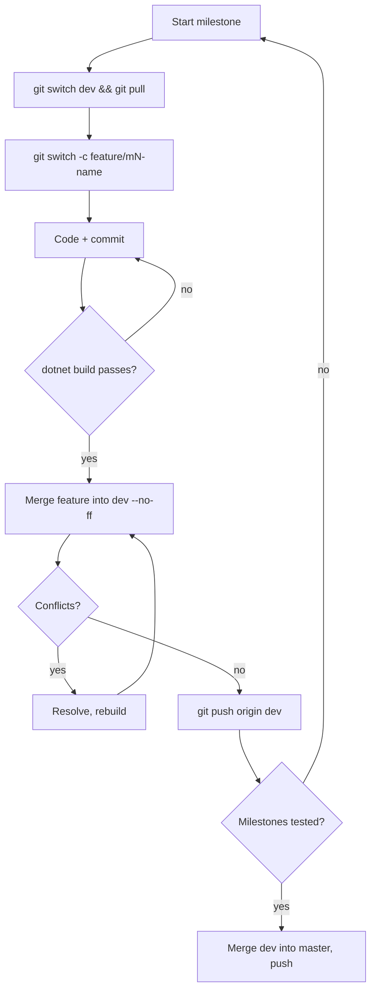
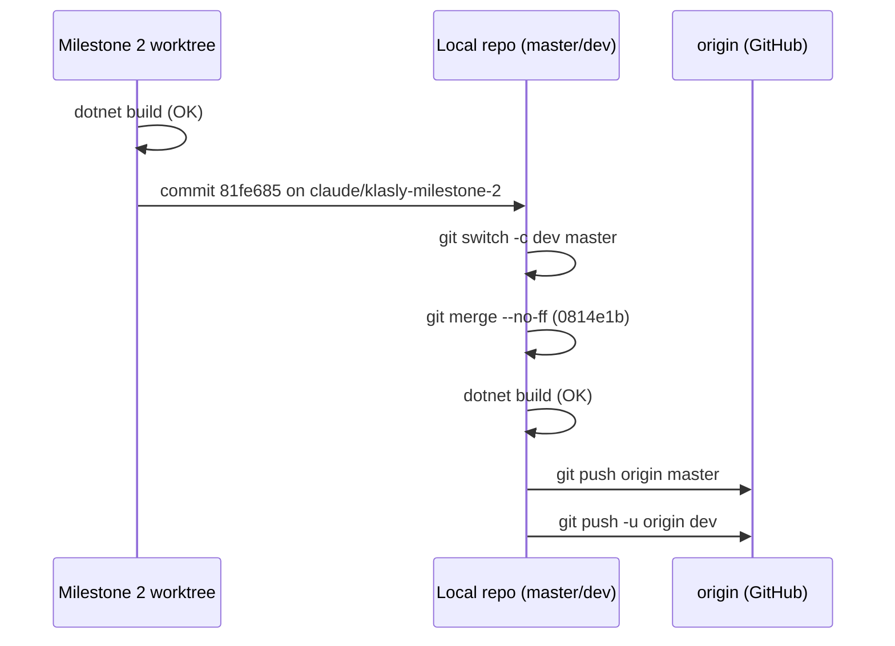
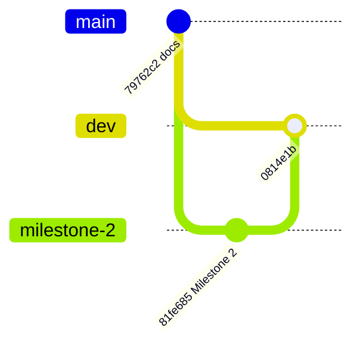

# Flowcharts — `dev` workflow branch

## Milestone flow

```mermaid
flowchart TD
    A[Start milestone] --> B[git switch dev && git pull]
    B --> C[git switch -c feature/mN-name]
    C --> D[Code + commit]
    D --> E{dotnet build passes?}
    E -- no --> D
    E -- yes --> F[Merge feature into dev --no-ff]
    F --> G{Conflicts?}
    G -- yes --> H[Resolve, rebuild] --> F
    G -- no --> I[git push origin dev]
    I --> J{Milestones tested?}
    J -- no --> A
    J -- yes --> K[Merge dev into master, push]
```

## Sequence of this task

```mermaid
sequenceDiagram
    participant W as Milestone 2 worktree
    participant L as Local repo (master/dev)
    participant O as origin (GitHub)
    W->>W: dotnet build (OK)
    W->>L: commit 81fe685 on claude/klasly-milestone-2
    L->>L: git switch -c dev master
    L->>L: git merge --no-ff (0814e1b)
    L->>L: dotnet build (OK)
    L->>O: git push origin master
    L->>O: git push -u origin dev
```

## Branch graph

```mermaid
gitGraph
    commit id: "79762c2 docs"
    branch dev
    branch milestone-2
    commit id: "81fe685 Milestone 2"
    checkout dev
    merge milestone-2 id: "0814e1b"
```
