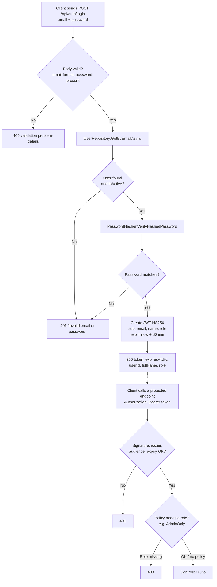
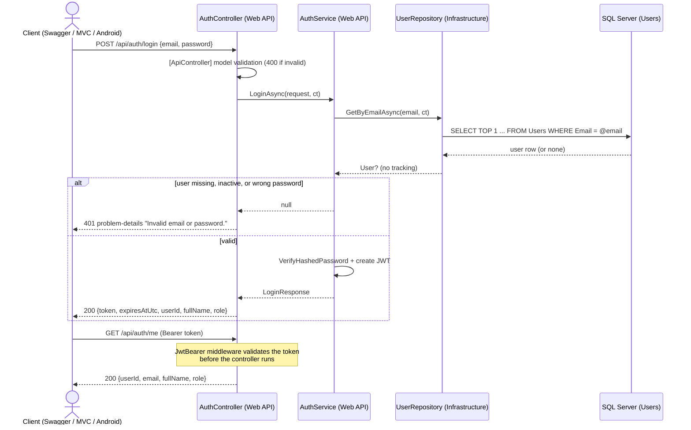

# Milestone 3 — Flowcharts

## Login logic

```mermaid
flowchart TD
    A[Client sends POST /api/auth/login<br/>email + password] --> B{Body valid?<br/>email format, password present}
    B -- No --> B1[400 validation problem-details]
    B -- Yes --> C[UserRepository.GetByEmailAsync]
    C --> D{User found<br/>and IsActive?}
    D -- No --> X[401 'Invalid email or password.']
    D -- Yes --> E[PasswordHasher.VerifyHashedPassword]
    E --> F{Password matches?}
    F -- No --> X
    F -- Yes --> G[Create JWT HS256<br/>sub, email, name, role<br/>exp = now + 60 min]
    G --> H[200 token, expiresAtUtc,<br/>userId, fullName, role]

    H -.-> I[Client calls a protected endpoint<br/>Authorization: Bearer token]
    I --> J{Signature, issuer,<br/>audience, expiry OK?}
    J -- No --> J1[401]
    J -- Yes --> K{Policy needs a role?<br/>e.g. AdminOnly}
    K -- Role missing --> K1[403]
    K -- OK / no policy --> L[Controller runs]
```

## Login sequence across layers

```mermaid
sequenceDiagram
    actor U as Client (Swagger / MVC / Android)
    participant C as AuthController (Web API)
    participant S as AuthService (Web API)
    participant R as UserRepository (Infrastructure)
    participant DB as SQL Server (Users)

    U->>C: POST /api/auth/login {email, password}
    C->>C: [ApiController] model validation (400 if invalid)
    C->>S: LoginAsync(request, ct)
    S->>R: GetByEmailAsync(email, ct)
    R->>DB: SELECT TOP 1 ... FROM Users WHERE Email = @email
    DB-->>R: user row (or none)
    R-->>S: User? (no tracking)
    alt user missing, inactive, or wrong password
        S-->>C: null
        C-->>U: 401 problem-details "Invalid email or password."
    else valid
        S->>S: VerifyHashedPassword + create JWT
        S-->>C: LoginResponse
        C-->>U: 200 {token, expiresAtUtc, userId, fullName, role}
    end

    U->>C: GET /api/auth/me (Bearer token)
    Note over C: JwtBearer middleware validates the token<br/>before the controller runs
    C-->>U: 200 {userId, email, fullName, role}
```

Database: no schema change in this milestone, so there is no ER diagram.
