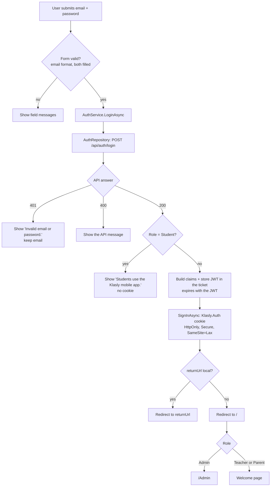
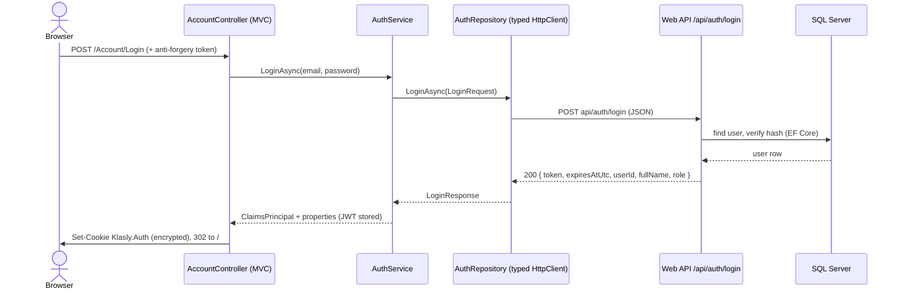

# Flowcharts: website login

## Login logic

```mermaid
flowchart TD
    A[User submits email + password] --> B{Form valid?<br/>email format, both filled}
    B -- no --> B1[Show field messages]
    B -- yes --> C[AuthService.LoginAsync]
    C --> D[AuthRepository: POST /api/auth/login]
    D --> E{API answer}
    E -- 401 --> E1["Show 'Invalid email or password.'<br/>keep email"]
    E -- 400 --> E2[Show the API message]
    E -- 200 --> F{Role = Student?}
    F -- yes --> F1["Show 'Students use the Klasly mobile app.'<br/>no cookie"]
    F -- no --> G[Build claims + store JWT in the ticket<br/>expires with the JWT]
    G --> H[SignInAsync: Klasly.Auth cookie<br/>HttpOnly, Secure, SameSite=Lax]
    H --> I{returnUrl local?}
    I -- yes --> J[Redirect to returnUrl]
    I -- no --> K[Redirect to /]
    K --> L{Role}
    L -- Admin --> M["/Admin"]
    L -- Teacher or Parent --> N[Welcome page]
```

## Layers

```mermaid
sequenceDiagram
    actor U as Browser
    participant C as AccountController (MVC)
    participant S as AuthService
    participant R as AuthRepository (typed HttpClient)
    participant A as Web API /api/auth/login
    participant DB as SQL Server

    U->>C: POST /Account/Login (+ anti-forgery token)
    C->>S: LoginAsync(email, password)
    S->>R: LoginAsync(LoginRequest)
    R->>A: POST api/auth/login (JSON)
    A->>DB: find user, verify hash (EF Core)
    DB-->>A: user row
    A-->>R: 200 { token, expiresAtUtc, userId, fullName, role }
    R-->>S: LoginResponse
    S-->>C: ClaimsPrincipal + properties (JWT stored)
    C->>U: Set-Cookie Klasly.Auth (encrypted), 302 to /
```
