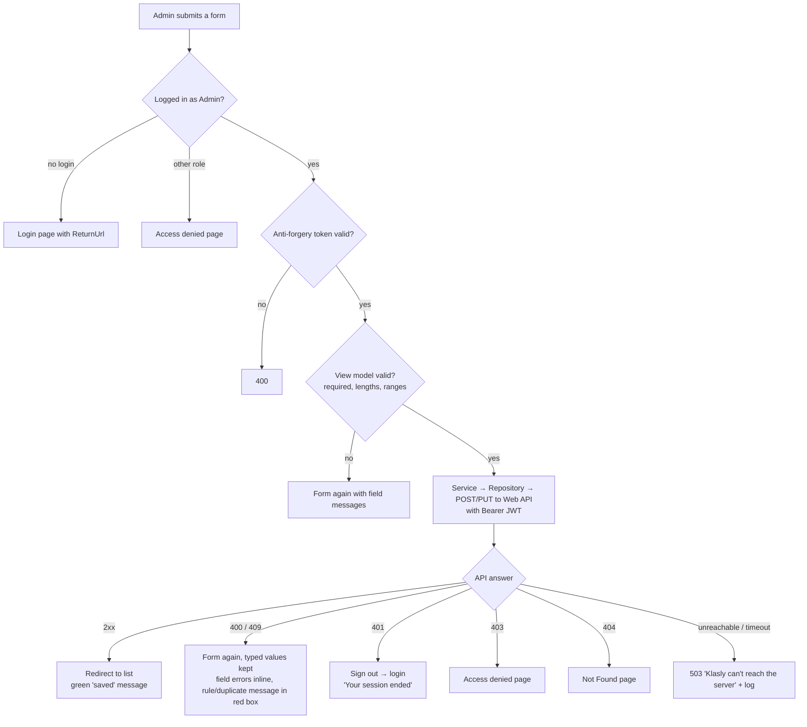
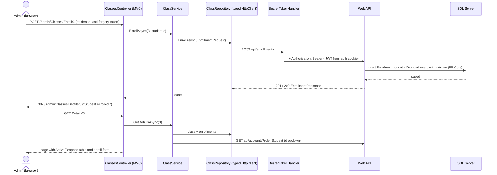

# Flowcharts: Admin portal

## Saving an admin form (Terms, Subjects, Accounts, Classes)

```mermaid
flowchart TD
    A[Admin submits a form] --> B{Logged in as Admin?}
    B -- no login --> B1[Login page with ReturnUrl]
    B -- other role --> B2[Access denied page]
    B -- yes --> C{Anti-forgery token valid?}
    C -- no --> C1[400]
    C -- yes --> D{View model valid?<br/>required, lengths, ranges}
    D -- no --> D1[Form again with field messages]
    D -- yes --> E[Service → Repository → POST/PUT to Web API<br/>with Bearer JWT]
    E --> F{API answer}
    F -- 2xx --> G[Redirect to list<br/>green 'saved' message]
    F -- 400 / 409 --> H[Form again, typed values kept<br/>field errors inline, rule/duplicate message in red box]
    F -- 401 --> I[Sign out → login<br/>'Your session ended']
    F -- 403 --> J[Access denied page]
    F -- 404 --> K[Not Found page]
    F -- unreachable / timeout --> L[503 'Klasly can't reach the server' + log]
```

## Enrolling a student (layers)

```mermaid
sequenceDiagram
    actor U as Admin (browser)
    participant C as ClassesController (MVC)
    participant S as ClassService
    participant R as ClassRepository (typed HttpClient)
    participant H as BearerTokenHandler
    participant A as Web API
    participant DB as SQL Server

    U->>C: POST /Admin/Classes/Enroll/3 (studentId, anti-forgery token)
    C->>S: EnrollAsync(3, studentId)
    S->>R: EnrollAsync(EnrollmentRequest)
    R->>H: POST api/enrollments
    H->>A: + Authorization: Bearer <JWT from auth cookie>
    A->>DB: insert Enrollment, or set a Dropped one back to Active (EF Core)
    DB-->>A: saved
    A-->>R: 201 / 200 EnrollmentResponse
    R-->>C: done
    C->>U: 302 /Admin/Classes/Details/3 ("Student enrolled.")
    U->>C: GET Details/3
    C->>S: GetDetailsAsync(3)
    S->>R: class + enrollments
    S->>A: GET api/accounts?role=Student (dropdown)
    C-->>U: page with Active/Dropped table and enroll form
```
