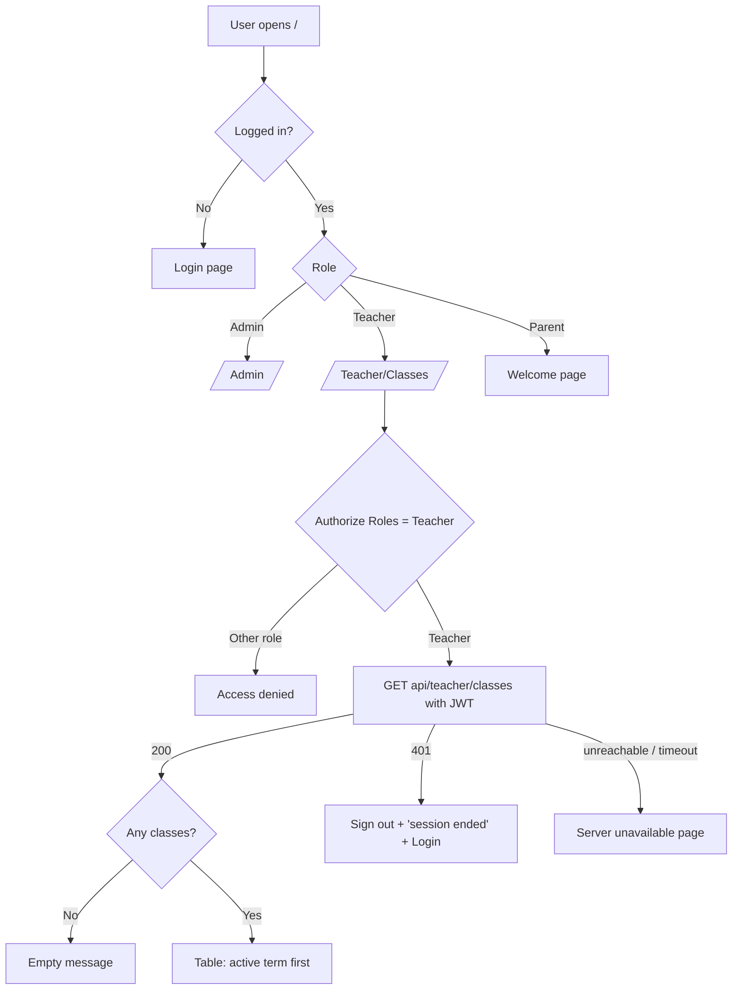
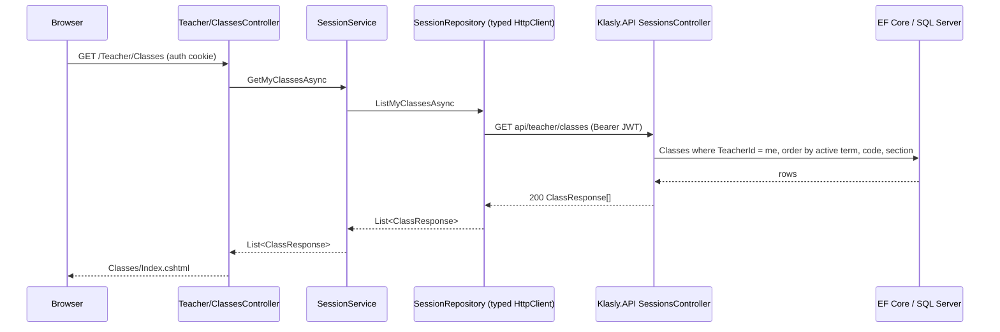

# Flowcharts: Teacher "My classes" page

## Logic

```mermaid
flowchart TD
    A[User opens /] --> B{Logged in?}
    B -- No --> L[Login page]
    B -- Yes --> C{Role}
    C -- Admin --> AD[/Admin/]
    C -- Teacher --> T[/Teacher/Classes/]
    C -- Parent --> W[Welcome page]
    T --> R{Authorize Roles = Teacher}
    R -- Other role --> X[Access denied]
    R -- Teacher --> API[GET api/teacher/classes with JWT]
    API -- 200 --> E{Any classes?}
    E -- No --> EM[Empty message]
    E -- Yes --> TB[Table: active term first]
    API -- 401 --> L2[Sign out + 'session ended' + Login]
    API -- unreachable / timeout --> U[Server unavailable page]
```

## Layers

```mermaid
sequenceDiagram
    participant B as Browser
    participant C as Teacher/ClassesController
    participant S as SessionService
    participant R as SessionRepository (typed HttpClient)
    participant A as Klasly.API SessionsController
    participant D as EF Core / SQL Server
    B->>C: GET /Teacher/Classes (auth cookie)
    C->>S: GetMyClassesAsync
    S->>R: ListMyClassesAsync
    R->>A: GET api/teacher/classes (Bearer JWT)
    A->>D: Classes where TeacherId = me, order by active term, code, section
    D-->>A: rows
    A-->>R: 200 ClassResponse[]
    R-->>S: List<ClassResponse>
    S-->>C: List<ClassResponse>
    C-->>B: Classes/Index.cshtml
```

No database change, so there is no ER diagram.
