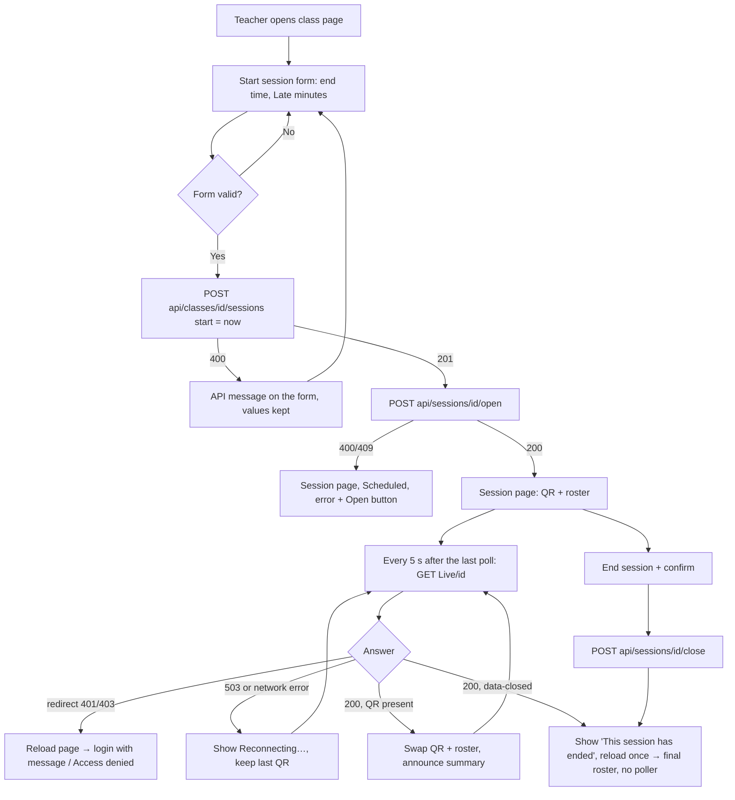
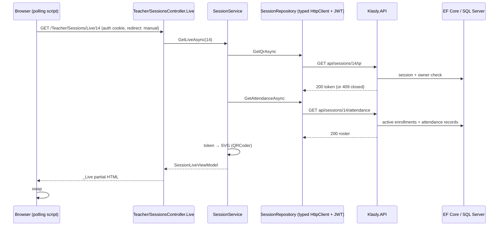

# Flowcharts: Teacher session page

## Logic

```mermaid
flowchart TD
    A[Teacher opens class page] --> B[Start session form: end time, Late minutes]
    B --> C{Form valid?}
    C -- No --> B
    C -- Yes --> D[POST api/classes/id/sessions start = now]
    D -- 400 --> E[API message on the form, values kept] --> B
    D -- 201 --> F[POST api/sessions/id/open]
    F -- 400/409 --> G[Session page, Scheduled, error + Open button]
    F -- 200 --> H[Session page: QR + roster]
    H --> P[Every 5 s after the last poll: GET Live/id]
    P --> Q{Answer}
    Q -- redirect 401/403 --> R[Reload page → login with message / Access denied]
    Q -- 503 or network error --> S[Show Reconnecting…, keep last QR] --> P
    Q -- 200, QR present --> T[Swap QR + roster, announce summary] --> P
    Q -- 200, data-closed --> U[Show 'This session has ended', reload once → final roster, no poller]
    H --> V[End session + confirm] --> W[POST api/sessions/id/close] --> U
```

## Layers (one poll)

```mermaid
sequenceDiagram
    participant B as Browser (polling script)
    participant C as Teacher/SessionsController.Live
    participant S as SessionService
    participant R as SessionRepository (typed HttpClient + JWT)
    participant A as Klasly.API
    participant D as EF Core / SQL Server
    B->>C: GET /Teacher/Sessions/Live/14 (auth cookie, redirect: manual)
    C->>S: GetLiveAsync(14)
    S->>R: GetQrAsync
    R->>A: GET api/sessions/14/qr
    A->>D: session + owner check
    A-->>R: 200 token (or 409 closed)
    S->>R: GetAttendanceAsync
    R->>A: GET api/sessions/14/attendance
    A->>D: active enrollments + attendance records
    A-->>R: 200 roster
    S->>S: token → SVG (QRCoder)
    S-->>C: SessionLiveViewModel
    C-->>B: _Live partial HTML
    B->>B: swap #live-panel, update aria-live summary
```

No database change, so there is no ER diagram.
