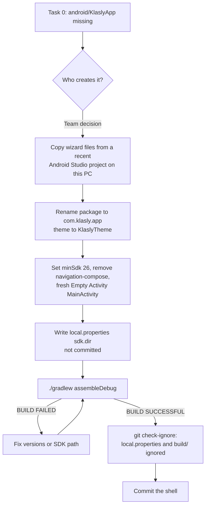
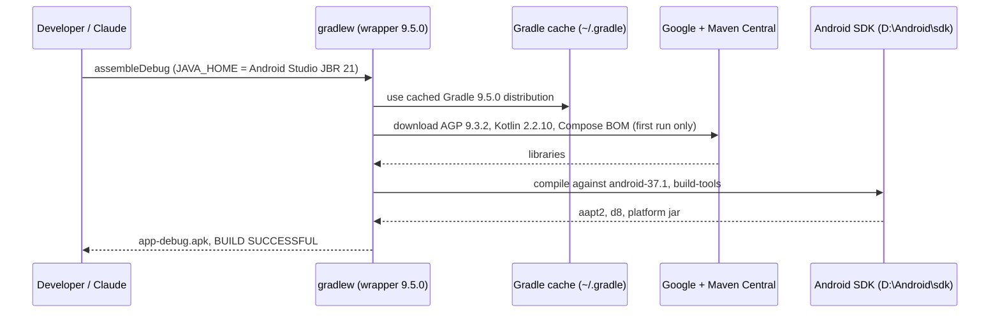

# Milestone 8 Task 0: flowcharts

## How the shell was created and checked

```mermaid
flowchart TD
    A[Task 0: android/KlaslyApp missing] --> B{Who creates it?}
    B -->|Team decision| C[Copy wizard files from a recent<br/>Android Studio project on this PC]
    C --> D[Rename package to com.klasly.app<br/>theme to KlaslyTheme]
    D --> E[Set minSdk 26, remove navigation-compose,<br/>fresh Empty Activity MainActivity]
    E --> F[Write local.properties sdk.dir<br/>not committed]
    F --> G[./gradlew assembleDebug]
    G -->|BUILD FAILED| H[Fix versions or SDK path] --> G
    G -->|BUILD SUCCESSFUL| I[git check-ignore:<br/>local.properties and build/ ignored]
    I --> J[Commit the shell]
```

## Build sequence across the tools

```mermaid
sequenceDiagram
    participant Dev as Developer / Claude
    participant W as gradlew (wrapper 9.5.0)
    participant G as Gradle cache (~/.gradle)
    participant M as Google + Maven Central
    participant SDK as Android SDK (D:\Android\sdk)
    Dev->>W: assembleDebug (JAVA_HOME = Android Studio JBR 21)
    W->>G: use cached Gradle 9.5.0 distribution
    W->>M: download AGP 9.3.2, Kotlin 2.2.10, Compose BOM (first run only)
    M-->>W: libraries
    W->>SDK: compile against android-37.1, build-tools
    SDK-->>W: aapt2, d8, platform jar
    W-->>Dev: app-debug.apk, BUILD SUCCESSFUL
```

No database change in this task, so there is no ER diagram.
