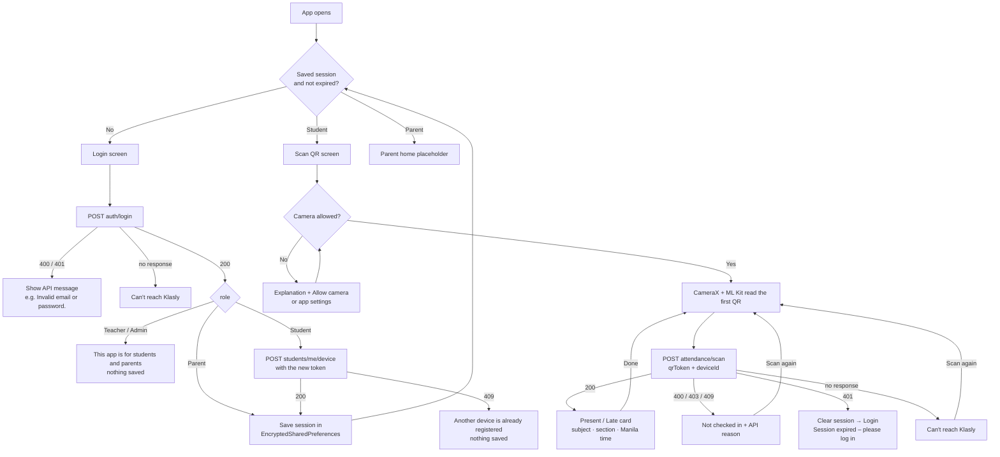
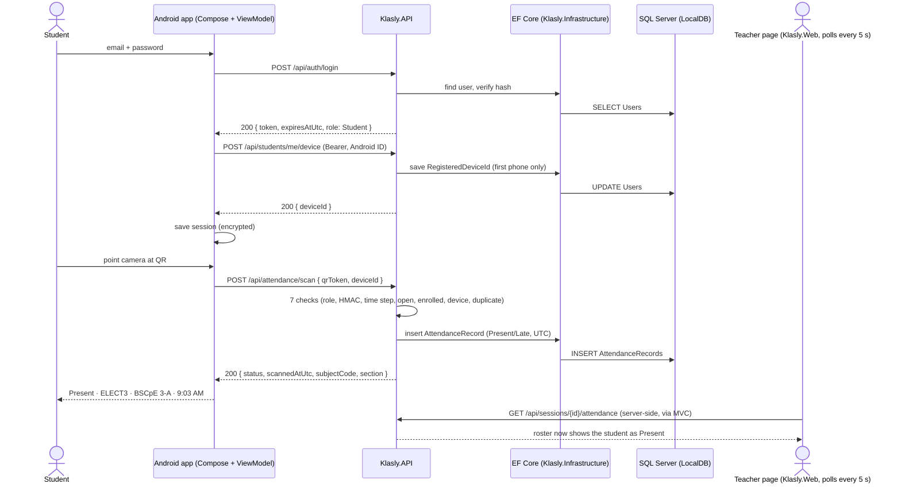

# Milestone 8: flowcharts

## Login and QR check-in logic

```mermaid
flowchart TD
    A[App opens] --> B{Saved session<br/>and not expired?}
    B -->|No| L[Login screen]
    B -->|Student| S[Scan QR screen]
    B -->|Parent| P[Parent home placeholder]

    L --> L1[POST auth/login]
    L1 -->|400 / 401| LE[Show API message<br/>e.g. Invalid email or password.]
    L1 -->|no response| LN[Can't reach Klasly]
    L1 -->|200| R{role}
    R -->|Teacher / Admin| RS[This app is for students and parents<br/>nothing saved]
    R -->|Parent| SAVE[Save session in<br/>EncryptedSharedPreferences]
    R -->|Student| D[POST students/me/device<br/>with the new token]
    D -->|409| DE[Another device is already registered<br/>nothing saved]
    D -->|200| SAVE
    SAVE --> B

    S --> C{Camera allowed?}
    C -->|No| CP[Explanation + Allow camera<br/>or app settings]
    CP --> C
    C -->|Yes| Q[CameraX + ML Kit read the first QR]
    Q --> SC[POST attendance/scan<br/>qrToken + deviceId]
    SC -->|200| OK[Present / Late card<br/>subject · section · Manila time]
    SC -->|400 / 403 / 409| NO[Not checked in + API reason]
    SC -->|401| EXP[Clear session → Login<br/>Session expired – please log in]
    SC -->|no response| NET[Can't reach Klasly]
    OK -->|Done| Q
    NO -->|Scan again| Q
    NET -->|Scan again| Q
```

## Sequence across the layers (a successful student check-in)

```mermaid
sequenceDiagram
    actor St as Student
    participant App as Android app (Compose + ViewModel)
    participant API as Klasly.API
    participant EF as EF Core (Klasly.Infrastructure)
    participant DB as SQL Server (LocalDB)
    actor T as Teacher page (Klasly.Web, polls every 5 s)

    St->>App: email + password
    App->>API: POST /api/auth/login
    API->>EF: find user, verify hash
    EF->>DB: SELECT Users
    API-->>App: 200 { token, expiresAtUtc, role: Student }
    App->>API: POST /api/students/me/device (Bearer, Android ID)
    API->>EF: save RegisteredDeviceId (first phone only)
    EF->>DB: UPDATE Users
    API-->>App: 200 { deviceId }
    App->>App: save session (encrypted)
    St->>App: point camera at QR
    App->>API: POST /api/attendance/scan { qrToken, deviceId }
    API->>API: 7 checks (role, HMAC, time step, open, enrolled, device, duplicate)
    API->>EF: insert AttendanceRecord (Present/Late, UTC)
    EF->>DB: INSERT AttendanceRecords
    API-->>App: 200 { status, scannedAtUtc, subjectCode, section }
    App-->>St: Present · ELECT3 · BSCpE 3-A · 9:03 AM
    T->>API: GET /api/sessions/{id}/attendance (server-side, via MVC)
    API-->>T: roster now shows the student as Present
```

No database change in this milestone, so there is no ER diagram.
