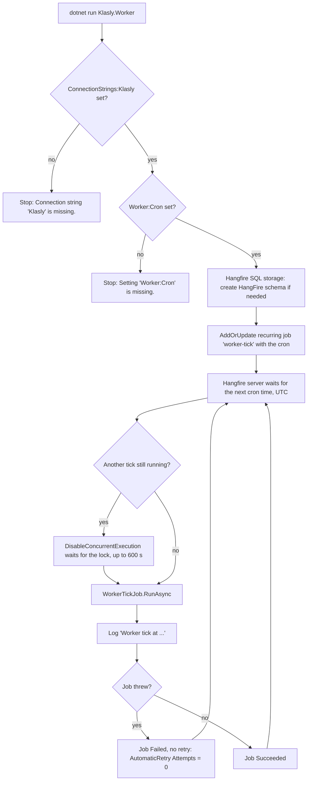
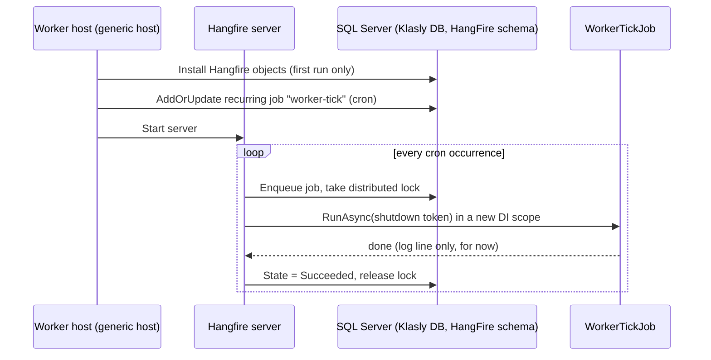

# Flowcharts — Milestone 9 Task 1 (Hangfire Worker)

## Worker startup and tick

```mermaid
flowchart TD
    A[dotnet run Klasly.Worker] --> B{ConnectionStrings:Klasly set?}
    B -- no --> X1[Stop: Connection string 'Klasly' is missing.]
    B -- yes --> C{Worker:Cron set?}
    C -- no --> X2[Stop: Setting 'Worker:Cron' is missing.]
    C -- yes --> D[Hangfire SQL storage: create HangFire schema if needed]
    D --> E[AddOrUpdate recurring job 'worker-tick' with the cron]
    E --> F[Hangfire server waits for the next cron time, UTC]
    F --> G{Another tick still running?}
    G -- yes --> H[DisableConcurrentExecution waits for the lock, up to 600 s]
    H --> I
    G -- no --> I[WorkerTickJob.RunAsync]
    I --> J[Log 'Worker tick at ...']
    J --> K{Job threw?}
    K -- yes --> L[Job Failed, no retry: AutomaticRetry Attempts = 0]
    K -- no --> M[Job Succeeded]
    L --> F
    M --> F
```

## Sequence across layers

```mermaid
sequenceDiagram
    participant Host as Worker host (generic host)
    participant HF as Hangfire server
    participant SQL as SQL Server (Klasly DB, HangFire schema)
    participant Job as WorkerTickJob

    Host->>SQL: Install Hangfire objects (first run only)
    Host->>SQL: AddOrUpdate recurring job "worker-tick" (cron)
    Host->>HF: Start server
    loop every cron occurrence
        HF->>SQL: Enqueue job, take distributed lock
        HF->>Job: RunAsync(shutdown token) in a new DI scope
        Job-->>HF: done (log line only, for now)
        HF->>SQL: State = Succeeded, release lock
    end
```

No Klasly table changed, so there is no `erDiagram`.
