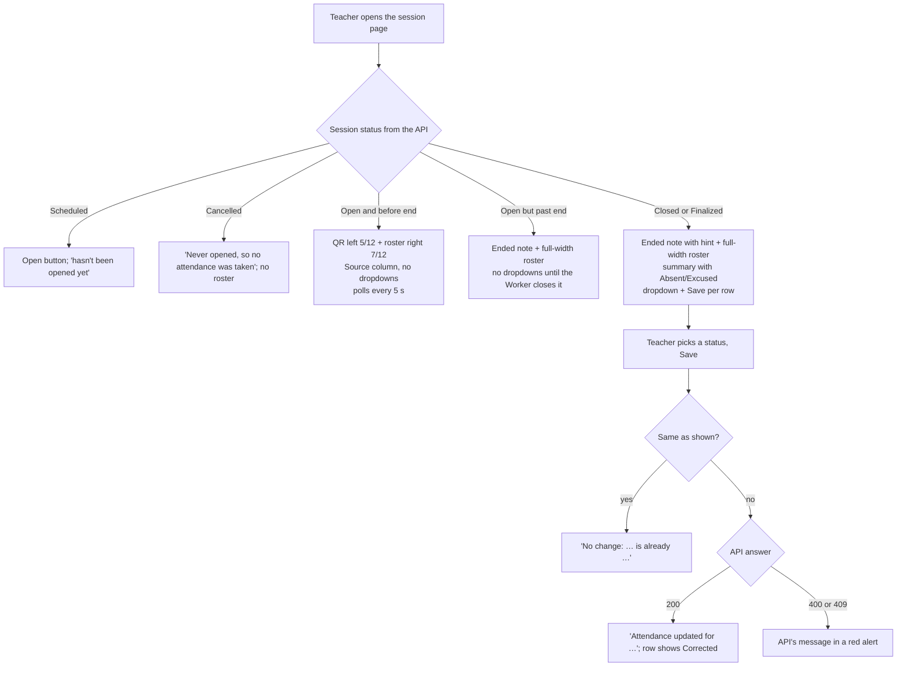
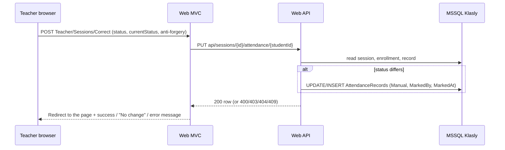

# Flowcharts: Milestone 9 session page (after polish)

## What the session page shows

```mermaid
flowchart TD
    A[Teacher opens the session page] --> B{Session status from the API}
    B -- Scheduled --> S[Open button; 'hasn't been opened yet']
    B -- Cancelled --> C['Never opened, so no attendance was taken'; no roster]
    B -- Open and before end --> L[QR left 5/12 + roster right 7/12<br/>Source column, no dropdowns<br/>polls every 5 s]
    B -- Open but past end --> E1[Ended note + full-width roster<br/>no dropdowns until the Worker closes it]
    B -- Closed or Finalized --> E2[Ended note with hint + full-width roster<br/>summary with Absent/Excused<br/>dropdown + Save per row]
    E2 --> P[Teacher picks a status, Save]
    P --> Q{Same as shown?}
    Q -- yes --> N['No change: … is already …']
    Q -- no --> R{API answer}
    R -- 200 --> OK['Attendance updated for …'; row shows Corrected]
    R -- 400 or 409 --> ER[API's message in a red alert]
```

## Sequence: a correction from the page

```mermaid
sequenceDiagram
    participant B as Teacher browser
    participant M as Web MVC
    participant A as Web API
    participant DB as MSSQL Klasly

    B->>M: POST Teacher/Sessions/Correct (status, currentStatus, anti-forgery)
    M->>A: PUT api/sessions/{id}/attendance/{studentId}
    A->>DB: read session, enrollment, record
    alt status differs
        A->>DB: UPDATE/INSERT AttendanceRecords (Manual, MarkedBy, MarkedAt)
    end
    A-->>M: 200 row (or 400/403/404/409)
    M-->>B: Redirect to the page + success / "No change" / error message
```

No `erDiagram`: the database did not change.
