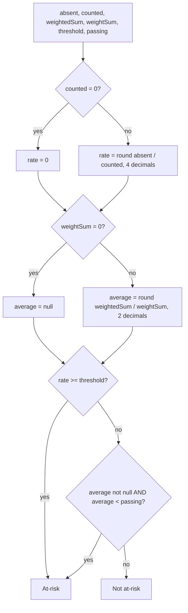
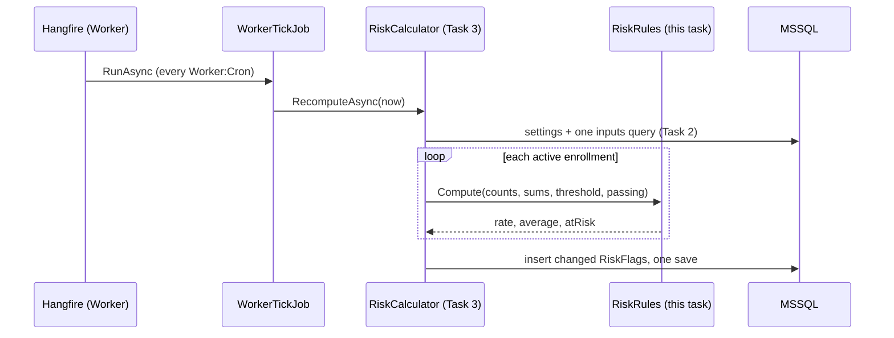

# Flowcharts — Milestone 11 Task 1 (risk rules)

## Rule logic

```mermaid
flowchart TD
    A[absent, counted, weightedSum, weightSum, threshold, passing] --> B{counted = 0?}
    B -- yes --> C[rate = 0]
    B -- no --> D[rate = round absent / counted, 4 decimals]
    C --> E{weightSum = 0?}
    D --> E
    E -- yes --> F[average = null]
    E -- no --> G[average = round weightedSum / weightSum, 2 decimals]
    F --> H{rate >= threshold?}
    G --> H
    H -- yes --> R[At-risk]
    H -- no --> I{average not null AND average < passing?}
    I -- yes --> R
    I -- no --> N[Not at-risk]
```

## Where it will sit (after Task 4)

```mermaid
sequenceDiagram
    participant H as Hangfire (Worker)
    participant J as WorkerTickJob
    participant C as RiskCalculator (Task 3)
    participant R as RiskRules (this task)
    participant DB as MSSQL
    H->>J: RunAsync (every Worker:Cron)
    J->>C: RecomputeAsync(now)
    C->>DB: settings + one inputs query (Task 2)
    loop each active enrollment
        C->>R: Compute(counts, sums, threshold, passing)
        R-->>C: rate, average, atRisk
    end
    C->>DB: insert changed RiskFlags, one save
```

No database change in this task, so no ER diagram.
