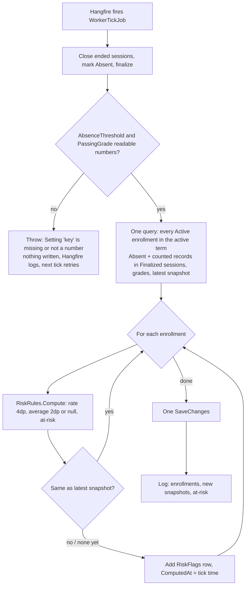
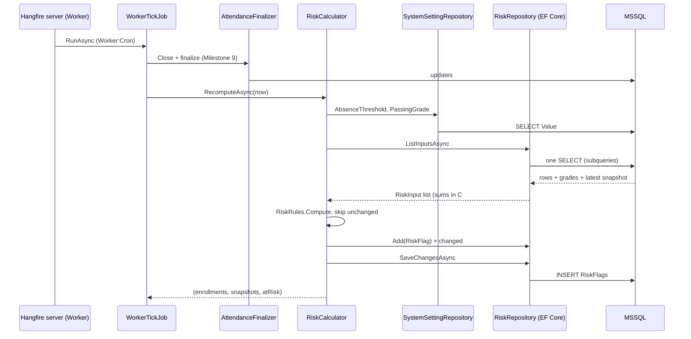
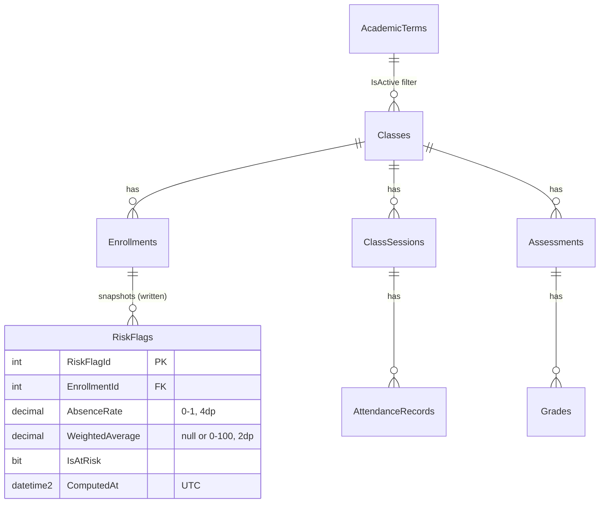

# Flowcharts — Worker risk flags (Milestone 11)

## Risk step logic

```mermaid
flowchart TD
    T[Hangfire fires WorkerTickJob] --> F[Close ended sessions, mark Absent, finalize]
    F --> S{AbsenceThreshold and PassingGrade readable numbers?}
    S -- no --> X[Throw: Setting 'key' is missing or not a number<br/>nothing written, Hangfire logs, next tick retries]
    S -- yes --> Q[One query: every Active enrollment in the active term<br/>Absent + counted records in Finalized sessions, grades, latest snapshot]
    Q --> L{For each enrollment}
    L --> R[RiskRules.Compute: rate 4dp, average 2dp or null, at-risk]
    R --> C{Same as latest snapshot?}
    C -- yes --> L
    C -- no / none yet --> A[Add RiskFlags row, ComputedAt = tick time]
    A --> L
    L -- done --> V[One SaveChanges]
    V --> G[Log: enrollments, new snapshots, at-risk]
```

## Across the layers

```mermaid
sequenceDiagram
    participant H as Hangfire server (Worker)
    participant J as WorkerTickJob
    participant A as AttendanceFinalizer
    participant C as RiskCalculator
    participant S as SystemSettingRepository
    participant R as RiskRepository (EF Core)
    participant DB as MSSQL
    H->>J: RunAsync (Worker:Cron)
    J->>A: Close + finalize (Milestone 9)
    A->>DB: updates
    J->>C: RecomputeAsync(now)
    C->>S: AbsenceThreshold, PassingGrade
    S->>DB: SELECT Value
    C->>R: ListInputsAsync
    R->>DB: one SELECT (subqueries)
    DB-->>R: rows + grades + latest snapshot
    R-->>C: RiskInput list (sums in C#)
    C->>C: RiskRules.Compute, skip unchanged
    C->>R: Add(RiskFlag) × changed
    C->>R: SaveChangesAsync
    R->>DB: INSERT RiskFlags
    C-->>J: (enrollments, snapshots, atRisk)
```

## Tables read and written (no schema change)

```mermaid
erDiagram
    AcademicTerms ||--o{ Classes : "IsActive filter"
    Classes ||--o{ Enrollments : has
    Classes ||--o{ ClassSessions : has
    Classes ||--o{ Assessments : has
    ClassSessions ||--o{ AttendanceRecords : has
    Assessments ||--o{ Grades : has
    Enrollments ||--o{ RiskFlags : "snapshots (written)"
    RiskFlags {
        int RiskFlagId PK
        int EnrollmentId FK
        decimal AbsenceRate "0-1, 4dp"
        decimal WeightedAverage "null or 0-100, 2dp"
        bit IsAtRisk
        datetime2 ComputedAt "UTC"
    }
```
