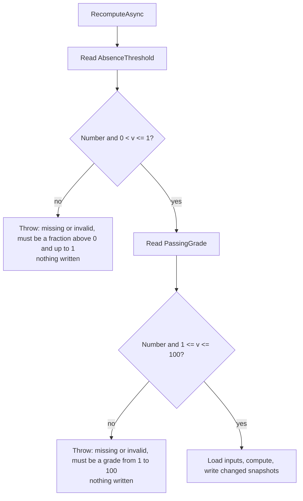
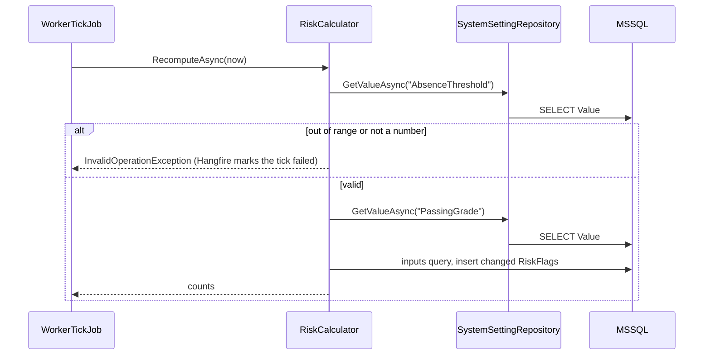

# Flowcharts — risk settings range check

```mermaid
flowchart TD
    A[RecomputeAsync] --> B[Read AbsenceThreshold]
    B --> C{Number and 0 < v <= 1?}
    C -- no --> X[Throw: missing or invalid, must be a fraction above 0 and up to 1<br/>nothing written]
    C -- yes --> D[Read PassingGrade]
    D --> E{Number and 1 <= v <= 100?}
    E -- no --> Y[Throw: missing or invalid, must be a grade from 1 to 100<br/>nothing written]
    E -- yes --> F[Load inputs, compute, write changed snapshots]
```

```mermaid
sequenceDiagram
    participant J as WorkerTickJob
    participant C as RiskCalculator
    participant S as SystemSettingRepository
    participant DB as MSSQL
    J->>C: RecomputeAsync(now)
    C->>S: GetValueAsync("AbsenceThreshold")
    S->>DB: SELECT Value
    alt out of range or not a number
        C-->>J: InvalidOperationException (Hangfire marks the tick failed)
    else valid
        C->>S: GetValueAsync("PassingGrade")
        S->>DB: SELECT Value
        C->>DB: inputs query, insert changed RiskFlags
        C-->>J: counts
    end
```

No database change, so no ER diagram.
