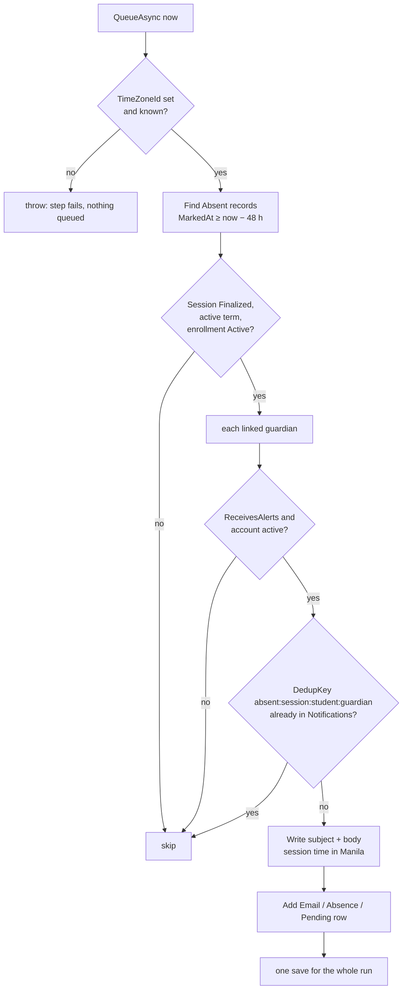
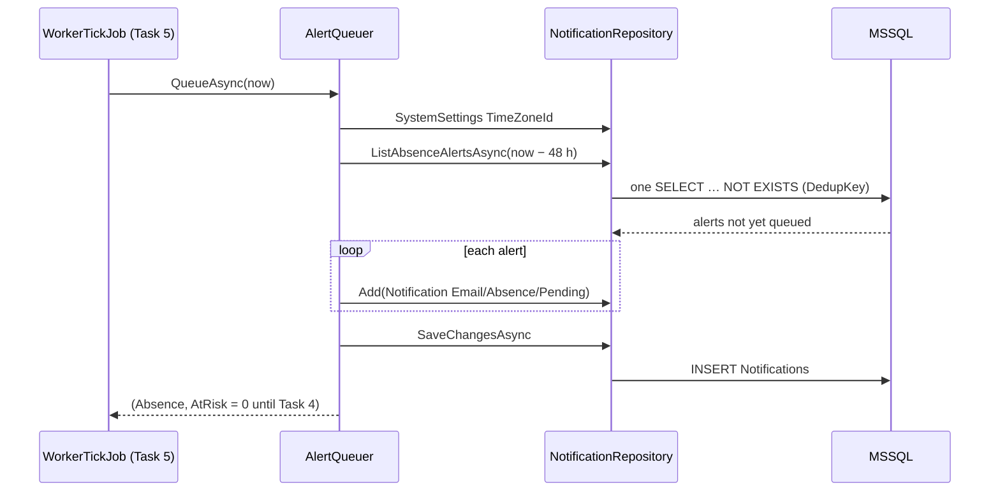
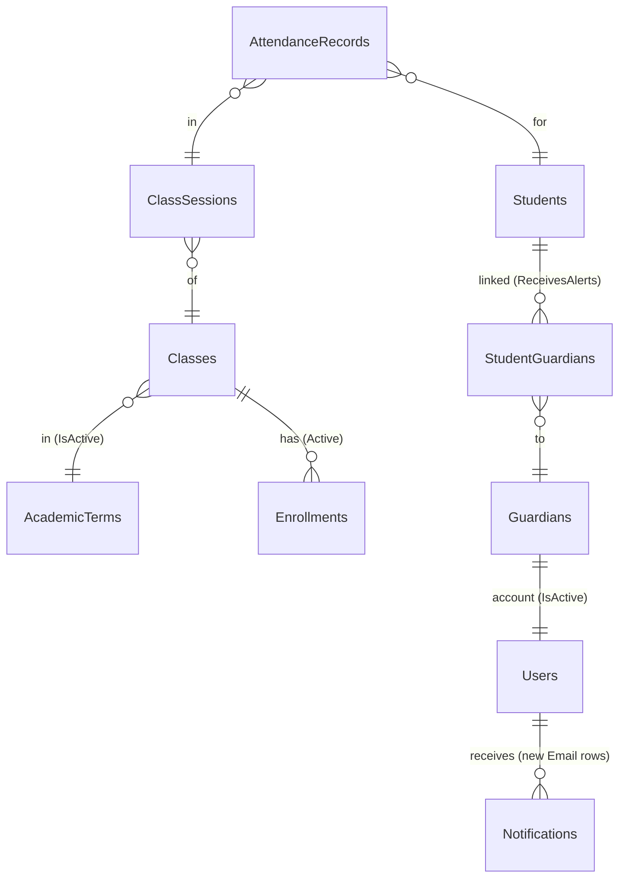

# Flowcharts — Milestone 12 Task 3 (Absence alerts)

## Queue logic

```mermaid
flowchart TD
    A[QueueAsync now] --> B{TimeZoneId set<br/>and known?}
    B -- no --> X[throw: step fails, nothing queued]
    B -- yes --> C[Find Absent records<br/>MarkedAt ≥ now − 48 h]
    C --> D{Session Finalized,<br/>active term,<br/>enrollment Active?}
    D -- no --> SKIP[skip]
    D -- yes --> E[each linked guardian]
    E --> F{ReceivesAlerts and<br/>account active?}
    F -- no --> SKIP
    F -- yes --> G{DedupKey absent:session:student:guardian<br/>already in Notifications?}
    G -- yes --> SKIP
    G -- no --> H[Write subject + body<br/>session time in Manila]
    H --> I[Add Email / Absence / Pending row]
    I --> J[one save for the whole run]
```

## Across the layers

```mermaid
sequenceDiagram
    participant J as WorkerTickJob (Task 5)
    participant Q as AlertQueuer
    participant R as NotificationRepository
    participant DB as MSSQL
    J->>Q: QueueAsync(now)
    Q->>R: SystemSettings TimeZoneId
    Q->>R: ListAbsenceAlertsAsync(now − 48 h)
    R->>DB: one SELECT … NOT EXISTS (DedupKey)
    DB-->>R: alerts not yet queued
    loop each alert
        Q->>R: Add(Notification Email/Absence/Pending)
    end
    Q->>R: SaveChangesAsync
    R->>DB: INSERT Notifications
    Q-->>J: (Absence, AtRisk = 0 until Task 4)
```

## Tables read and written (no schema change)

```mermaid
erDiagram
    AttendanceRecords }o--|| ClassSessions : "in"
    ClassSessions }o--|| Classes : "of"
    Classes }o--|| AcademicTerms : "in (IsActive)"
    Classes ||--o{ Enrollments : "has (Active)"
    AttendanceRecords }o--|| Students : "for"
    Students ||--o{ StudentGuardians : "linked (ReceivesAlerts)"
    StudentGuardians }o--|| Guardians : "to"
    Guardians ||--|| Users : "account (IsActive)"
    Users ||--o{ Notifications : "receives (new Email rows)"
```
