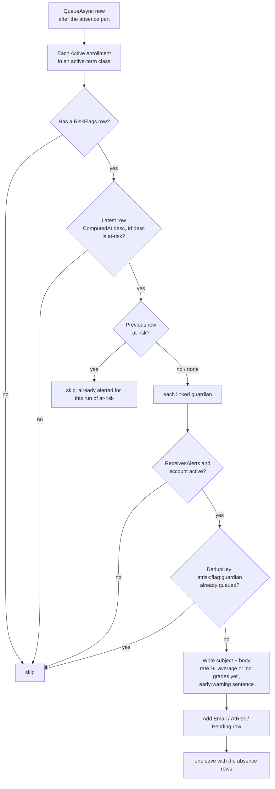
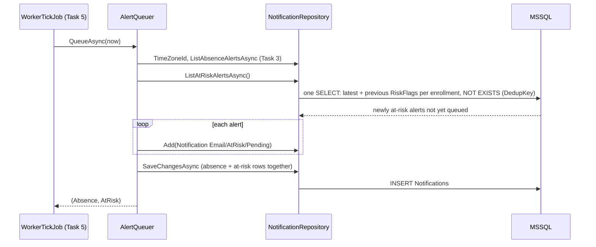
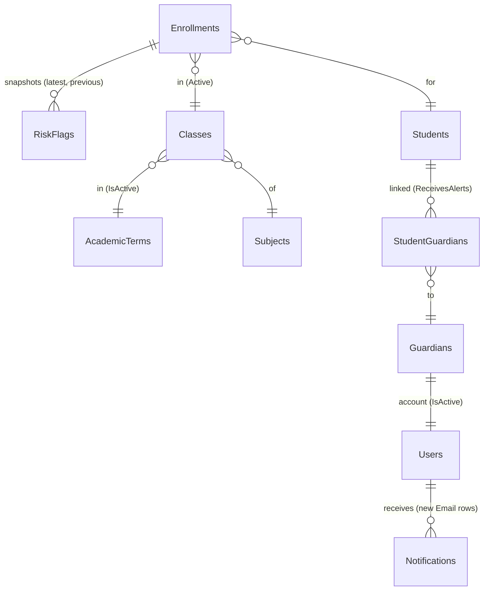

# Flowcharts — Milestone 12 Task 4 (At-risk alerts)

## Queue logic (the at-risk part of QueueAsync)

```mermaid
flowchart TD
    A[QueueAsync now<br/>after the absence part] --> B[Each Active enrollment<br/>in an active-term class]
    B --> C{Has a RiskFlags row?}
    C -- no --> SKIP[skip]
    C -- yes --> D{Latest row<br/>ComputedAt desc, Id desc<br/>is at-risk?}
    D -- no --> SKIP
    D -- yes --> E{Previous row<br/>at-risk?}
    E -- yes --> SKIP2[skip: already alerted for this run of at-risk]
    E -- "no / none" --> F[each linked guardian]
    F --> G{ReceivesAlerts and<br/>account active?}
    G -- no --> SKIP
    G -- yes --> H{DedupKey atrisk:flag:guardian<br/>already queued?}
    H -- yes --> SKIP
    H -- no --> I[Write subject + body<br/>rate %, average or 'no grades yet',<br/>early-warning sentence]
    I --> J[Add Email / AtRisk / Pending row]
    J --> K[one save with the absence rows]
```

## Across the layers

```mermaid
sequenceDiagram
    participant J as WorkerTickJob (Task 5)
    participant Q as AlertQueuer
    participant R as NotificationRepository
    participant DB as MSSQL
    J->>Q: QueueAsync(now)
    Q->>R: TimeZoneId, ListAbsenceAlertsAsync (Task 3)
    Q->>R: ListAtRiskAlertsAsync()
    R->>DB: one SELECT: latest + previous RiskFlags per enrollment, NOT EXISTS (DedupKey)
    DB-->>R: newly at-risk alerts not yet queued
    loop each alert
        Q->>R: Add(Notification Email/AtRisk/Pending)
    end
    Q->>R: SaveChangesAsync (absence + at-risk rows together)
    R->>DB: INSERT Notifications
    Q-->>J: (Absence, AtRisk)
```

## Tables read and written (no schema change)

```mermaid
erDiagram
    Enrollments ||--o{ RiskFlags : "snapshots (latest, previous)"
    Enrollments }o--|| Classes : "in (Active)"
    Classes }o--|| AcademicTerms : "in (IsActive)"
    Classes }o--|| Subjects : "of"
    Enrollments }o--|| Students : "for"
    Students ||--o{ StudentGuardians : "linked (ReceivesAlerts)"
    StudentGuardians }o--|| Guardians : "to"
    Guardians ||--|| Users : "account (IsActive)"
    Users ||--o{ Notifications : "receives (new Email rows)"
```
