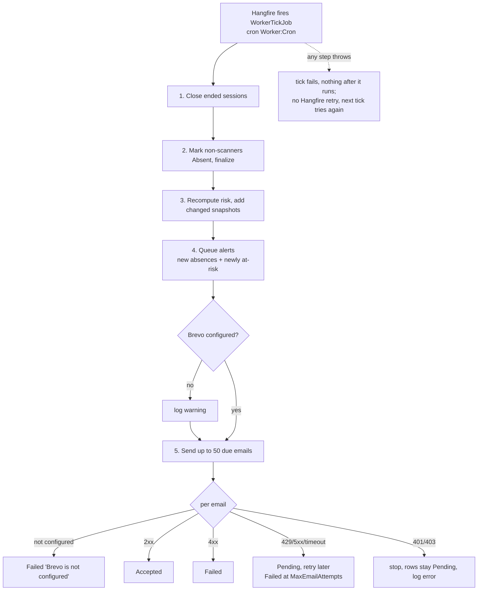
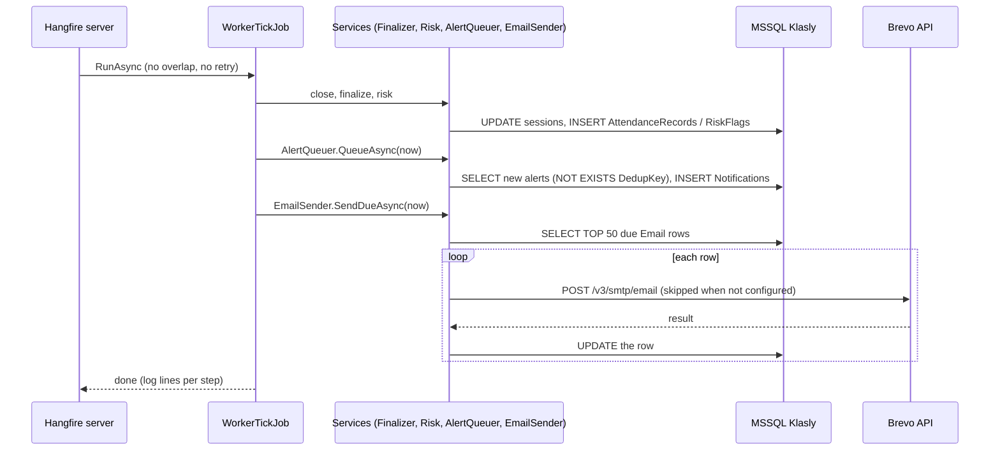

# Flowcharts — Milestone 12 Task 5 (Worker tick with alerts and emails)

## One tick

```mermaid
flowchart TD
    A[Hangfire fires WorkerTickJob<br/>cron Worker:Cron] --> B[1. Close ended sessions]
    B --> C[2. Mark non-scanners Absent, finalize]
    C --> D[3. Recompute risk, add changed snapshots]
    D --> E[4. Queue alerts<br/>new absences + newly at-risk]
    E --> F{Brevo configured?}
    F -- no --> G[log warning] --> H
    F -- yes --> H[5. Send up to 50 due emails]
    H --> I{per email}
    I -- not configured --> J[Failed 'Brevo is not configured']
    I -- 2xx --> K[Accepted]
    I -- 4xx --> L[Failed]
    I -- 429/5xx/timeout --> M[Pending, retry later<br/>Failed at MaxEmailAttempts]
    I -- 401/403 --> N[stop, rows stay Pending, log error]
    A -. any step throws .-> X[tick fails, nothing after it runs;<br/>no Hangfire retry, next tick tries again]
```

## Across the layers

```mermaid
sequenceDiagram
    participant H as Hangfire server
    participant J as WorkerTickJob
    participant S as Services (Finalizer, Risk, AlertQueuer, EmailSender)
    participant DB as MSSQL Klasly
    participant B as Brevo API
    H->>J: RunAsync (no overlap, no retry)
    J->>S: close, finalize, risk
    S->>DB: UPDATE sessions, INSERT AttendanceRecords / RiskFlags
    J->>S: AlertQueuer.QueueAsync(now)
    S->>DB: SELECT new alerts (NOT EXISTS DedupKey), INSERT Notifications
    J->>S: EmailSender.SendDueAsync(now)
    S->>DB: SELECT TOP 50 due Email rows
    loop each row
        S->>B: POST /v3/smtp/email (skipped when not configured)
        B-->>S: result
        S->>DB: UPDATE the row
    end
    J-->>H: done (log lines per step)
```

No schema change, so no ER diagram.
