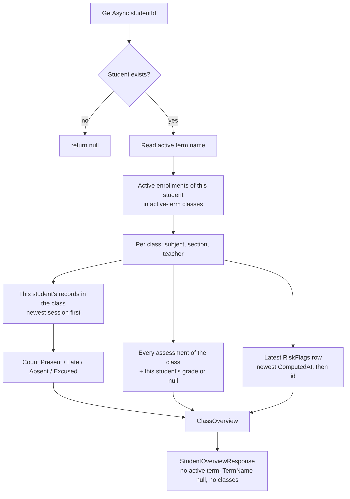
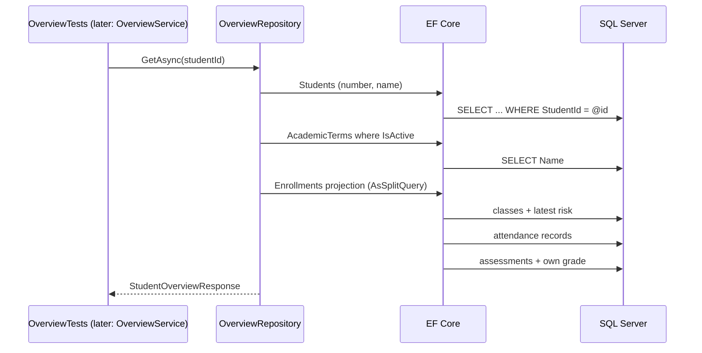

# Flowcharts — Milestone 13 Task 1 (student overview query)

## Logic

```mermaid
flowchart TD
    A[GetAsync studentId] --> B{Student exists?}
    B -- no --> N[return null]
    B -- yes --> C[Read active term name]
    C --> D[Active enrollments of this student<br/>in active-term classes]
    D --> E[Per class: subject, section, teacher]
    E --> F[This student's records in the class<br/>newest session first]
    E --> G[Every assessment of the class<br/>+ this student's grade or null]
    E --> H[Latest RiskFlags row<br/>newest ComputedAt, then id]
    F --> I[Count Present / Late / Absent / Excused]
    I --> J[ClassOverview]
    G --> J
    H --> J
    J --> K[StudentOverviewResponse<br/>no active term: TermName null, no classes]
```

## Sequence

```mermaid
sequenceDiagram
    participant T as OverviewTests (later: OverviewService)
    participant R as OverviewRepository
    participant EF as EF Core
    participant DB as SQL Server
    T->>R: GetAsync(studentId)
    R->>EF: Students (number, name)
    EF->>DB: SELECT ... WHERE StudentId = @id
    R->>EF: AcademicTerms where IsActive
    EF->>DB: SELECT Name
    R->>EF: Enrollments projection (AsSplitQuery)
    EF->>DB: classes + latest risk
    EF->>DB: attendance records
    EF->>DB: assessments + own grade
    R-->>T: StudentOverviewResponse
```

No database change, so there is no ER diagram.
