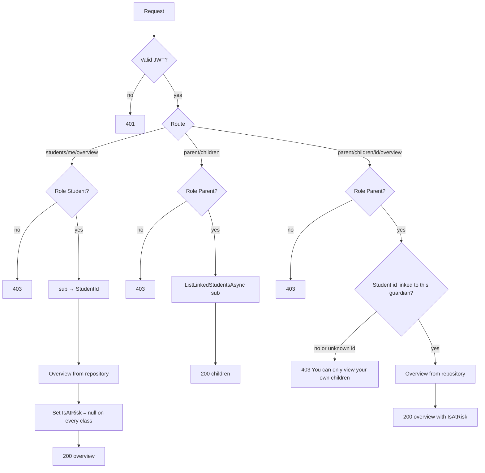
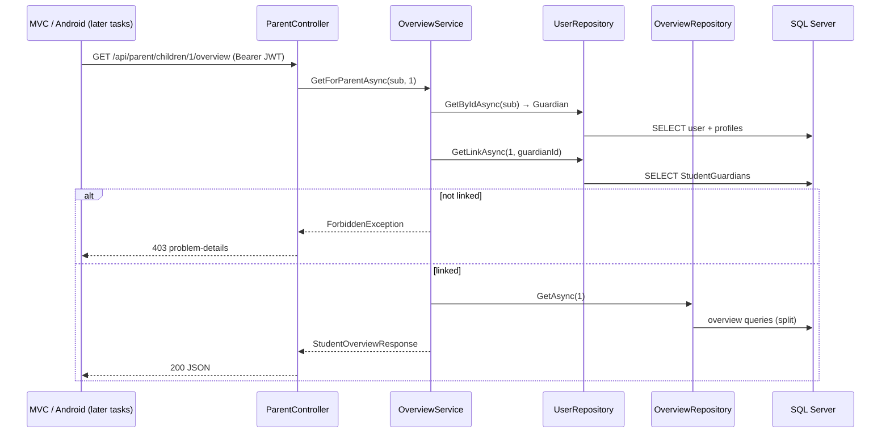

# Flowcharts — Milestone 13 Task 2 (overview endpoints)

## Logic

```mermaid
flowchart TD
    A[Request] --> B{Valid JWT?}
    B -- no --> E401[401]
    B -- yes --> C{Route}
    C -- students/me/overview --> S1{Role Student?}
    S1 -- no --> E403a[403]
    S1 -- yes --> S2[sub → StudentId]
    S2 --> S3[Overview from repository]
    S3 --> S4[Set IsAtRisk = null on every class]
    S4 --> OK1[200 overview]
    C -- parent/children --> P1{Role Parent?}
    P1 -- no --> E403b[403]
    P1 -- yes --> P2[ListLinkedStudentsAsync sub]
    P2 --> OK2[200 children]
    C -- parent/children/id/overview --> Q1{Role Parent?}
    Q1 -- no --> E403c[403]
    Q1 -- yes --> Q2{Student id linked to this guardian?}
    Q2 -- no or unknown id --> E403d[403 You can only view your own children]
    Q2 -- yes --> Q3[Overview from repository]
    Q3 --> OK3[200 overview with IsAtRisk]
```

## Sequence (parent reads a child)

```mermaid
sequenceDiagram
    participant C as MVC / Android (later tasks)
    participant API as ParentController
    participant S as OverviewService
    participant U as UserRepository
    participant R as OverviewRepository
    participant DB as SQL Server
    C->>API: GET /api/parent/children/1/overview (Bearer JWT)
    API->>S: GetForParentAsync(sub, 1)
    S->>U: GetByIdAsync(sub) → Guardian
    U->>DB: SELECT user + profiles
    S->>U: GetLinkAsync(1, guardianId)
    U->>DB: SELECT StudentGuardians
    alt not linked
        S-->>API: ForbiddenException
        API-->>C: 403 problem-details
    else linked
        S->>R: GetAsync(1)
        R->>DB: overview queries (split)
        S-->>API: StudentOverviewResponse
        API-->>C: 200 JSON
    end
```

No database change, so there is no ER diagram.
