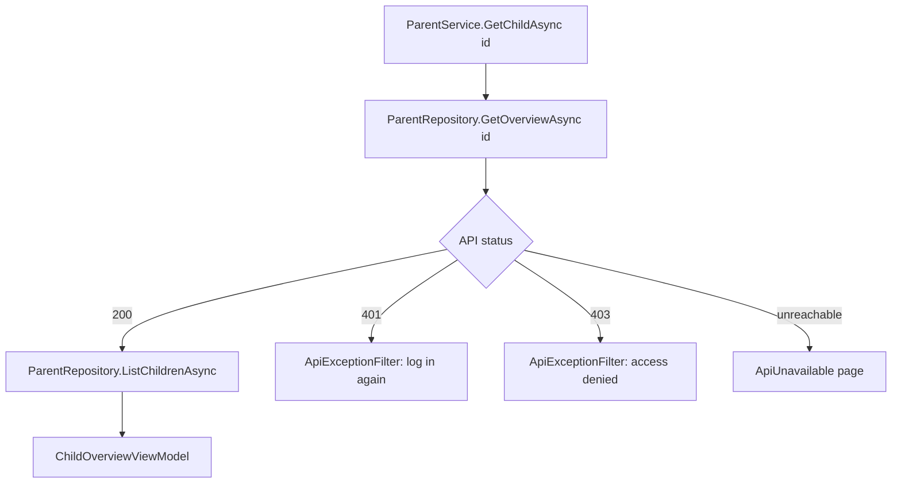
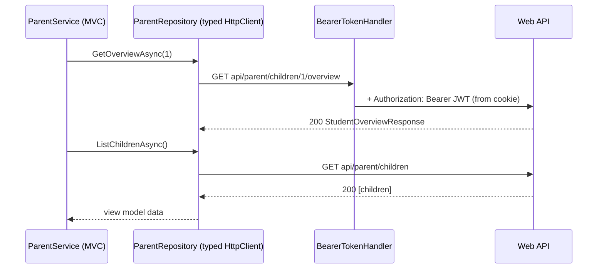

# Flowcharts — Milestone 13 Task 3 (Web data layer for parents)

## Logic

```mermaid
flowchart TD
    A[ParentService.GetChildAsync id] --> B[ParentRepository.GetOverviewAsync id]
    B --> C{API status}
    C -- 200 --> D[ParentRepository.ListChildrenAsync]
    D --> E[ChildOverviewViewModel]
    C -- 401 --> F[ApiExceptionFilter: log in again]
    C -- 403 --> G[ApiExceptionFilter: access denied]
    C -- unreachable --> H[ApiUnavailable page]
```

## Sequence

```mermaid
sequenceDiagram
    participant S as ParentService (MVC)
    participant R as ParentRepository (typed HttpClient)
    participant B as BearerTokenHandler
    participant API as Web API
    S->>R: GetOverviewAsync(1)
    R->>B: GET api/parent/children/1/overview
    B->>API: + Authorization: Bearer JWT (from cookie)
    API-->>R: 200 StudentOverviewResponse
    S->>R: ListChildrenAsync()
    R->>API: GET api/parent/children
    API-->>R: 200 [children]
    R-->>S: view model data
```

No database change, so there is no ER diagram.
