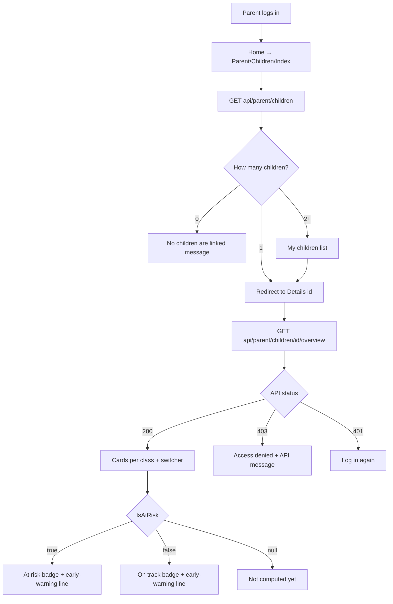
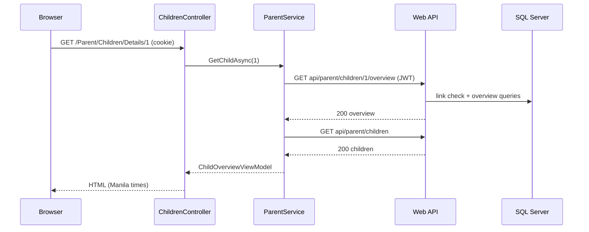

# Flowcharts — Milestone 13 Task 4 (Parent portal pages)

## Logic

```mermaid
flowchart TD
    A[Parent logs in] --> B[Home → Parent/Children/Index]
    B --> C[GET api/parent/children]
    C --> D{How many children?}
    D -- 0 --> E[No children are linked message]
    D -- 1 --> F[Redirect to Details id]
    D -- 2+ --> G[My children list]
    G --> F
    F --> H[GET api/parent/children/id/overview]
    H --> I{API status}
    I -- 200 --> J[Cards per class + switcher]
    I -- 403 --> K[Access denied + API message]
    I -- 401 --> L[Log in again]
    J --> M{IsAtRisk}
    M -- true --> N[At risk badge + early-warning line]
    M -- false --> O[On track badge + early-warning line]
    M -- null --> P[Not computed yet]
```

## Sequence

```mermaid
sequenceDiagram
    participant B as Browser
    participant MVC as ChildrenController
    participant S as ParentService
    participant API as Web API
    participant DB as SQL Server
    B->>MVC: GET /Parent/Children/Details/1 (cookie)
    MVC->>S: GetChildAsync(1)
    S->>API: GET api/parent/children/1/overview (JWT)
    API->>DB: link check + overview queries
    API-->>S: 200 overview
    S->>API: GET api/parent/children
    API-->>S: 200 children
    S-->>MVC: ChildOverviewViewModel
    MVC-->>B: HTML (Manila times)
```

No database change, so there is no ER diagram.
