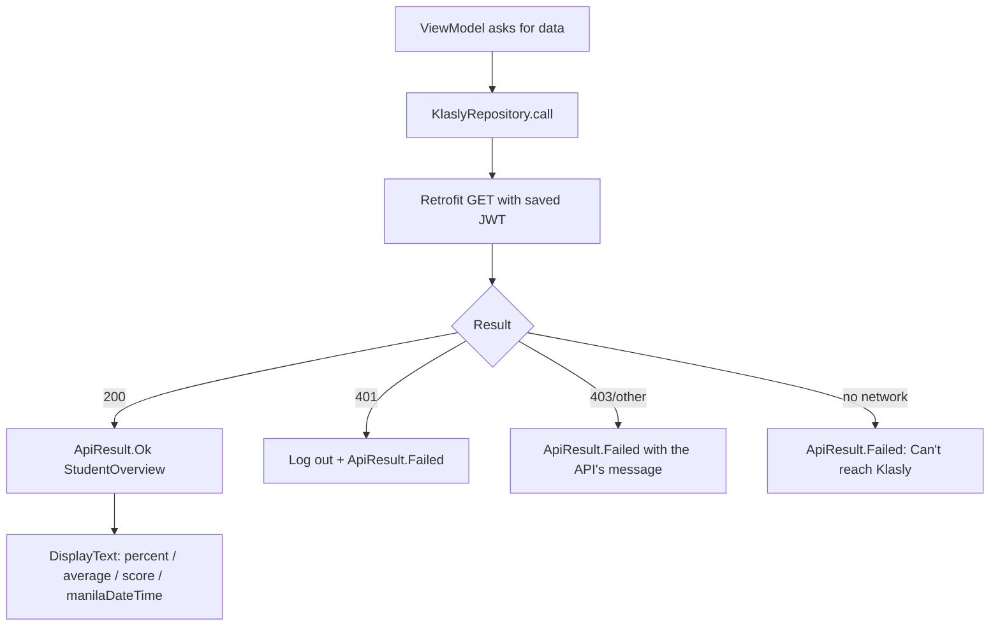
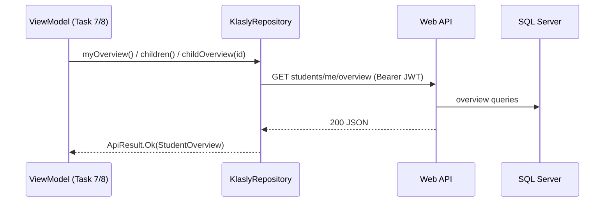

# Flowcharts — Milestone 13 Task 6 (Android data layer)

## Logic

```mermaid
flowchart TD
    A[ViewModel asks for data] --> B[KlaslyRepository.call]
    B --> C[Retrofit GET with saved JWT]
    C --> D{Result}
    D -- 200 --> E[ApiResult.Ok StudentOverview]
    D -- 401 --> F[Log out + ApiResult.Failed]
    D -- 403/other --> G[ApiResult.Failed with the API's message]
    D -- no network --> H[ApiResult.Failed: Can't reach Klasly]
    E --> I[DisplayText: percent / average / score / manilaDateTime]
```

## Sequence

```mermaid
sequenceDiagram
    participant VM as ViewModel (Task 7/8)
    participant R as KlaslyRepository
    participant API as Web API
    participant DB as SQL Server
    VM->>R: myOverview() / children() / childOverview(id)
    R->>API: GET students/me/overview (Bearer JWT)
    API->>DB: overview queries
    API-->>R: 200 JSON
    R-->>VM: ApiResult.Ok(StudentOverview)
```

No database change, so there is no ER diagram.
