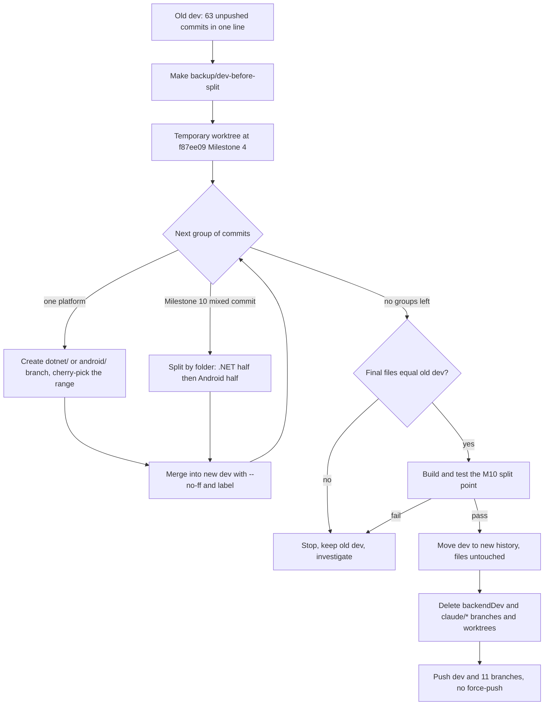
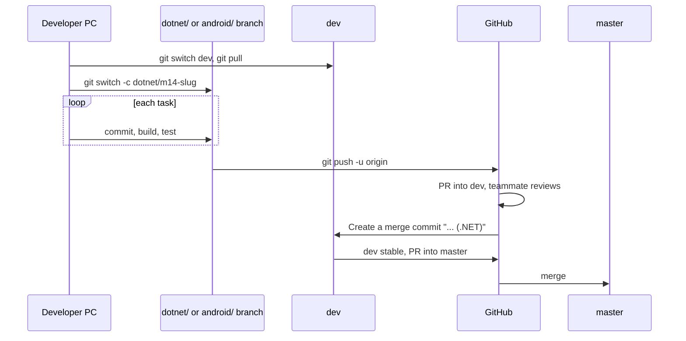

# Flowcharts: git branch split

## Re-sort logic

```mermaid
flowchart TD
  A[Old dev: 63 unpushed commits in one line] --> B[Make backup/dev-before-split]
  B --> C[Temporary worktree at f87ee09 Milestone 4]
  C --> D{Next group of commits}
  D -->|one platform| E[Create dotnet/ or android/ branch, cherry-pick the range]
  D -->|Milestone 10 mixed commit| F[Split by folder: .NET half then Android half]
  E --> G[Merge into new dev with --no-ff and label]
  F --> G
  G --> D
  D -->|no groups left| H{Final files equal old dev?}
  H -->|no| X[Stop, keep old dev, investigate]
  H -->|yes| I[Build and test the M10 split point]
  I -->|fail| X
  I -->|pass| J[Move dev to new history, files untouched]
  J --> K[Delete backendDev and claude/* branches and worktrees]
  K --> L[Push dev and 11 branches, no force-push]
```

## Day-to-day milestone workflow

```mermaid
sequenceDiagram
  participant Dev as Developer PC
  participant B as dotnet/ or android/ branch
  participant D as dev
  participant GH as GitHub
  participant M as master
  Dev->>D: git switch dev, git pull
  Dev->>B: git switch -c dotnet/m14-slug
  loop each task
    Dev->>B: commit, build, test
  end
  B->>GH: git push -u origin
  GH->>GH: PR into dev, teammate reviews
  GH->>D: Create a merge commit "... (.NET)"
  D->>GH: dev stable, PR into master
  GH->>M: merge
```
