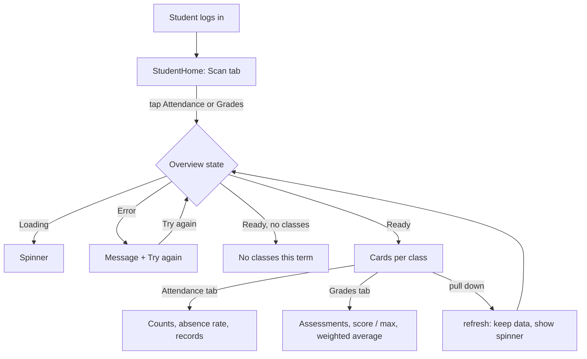
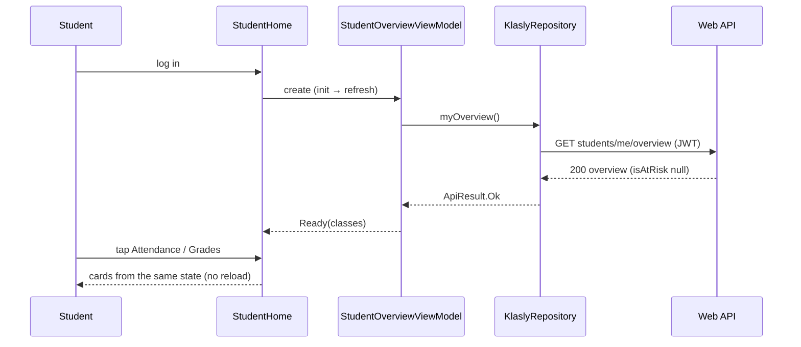

# Flowcharts — Milestone 13 Task 7 (Student tabs)

## Logic

```mermaid
flowchart TD
    A[Student logs in] --> B[StudentHome: Scan tab]
    B -->|tap Attendance or Grades| C{Overview state}
    C -- Loading --> D[Spinner]
    C -- Error --> E[Message + Try again]
    C -- Ready, no classes --> F[No classes this term]
    C -- Ready --> G[Cards per class]
    G -->|Attendance tab| H[Counts, absence rate, records]
    G -->|Grades tab| I[Assessments, score / max, weighted average]
    G -->|pull down| J[refresh: keep data, show spinner]
    J --> C
    E -->|Try again| C
```

## Sequence

```mermaid
sequenceDiagram
    participant U as Student
    participant H as StudentHome
    participant VM as StudentOverviewViewModel
    participant R as KlaslyRepository
    participant API as Web API
    U->>H: log in
    H->>VM: create (init → refresh)
    VM->>R: myOverview()
    R->>API: GET students/me/overview (JWT)
    API-->>R: 200 overview (isAtRisk null)
    R-->>VM: ApiResult.Ok
    VM-->>H: Ready(classes)
    U->>H: tap Attendance / Grades
    H-->>U: cards from the same state (no reload)
```

No database change, so there is no ER diagram.
