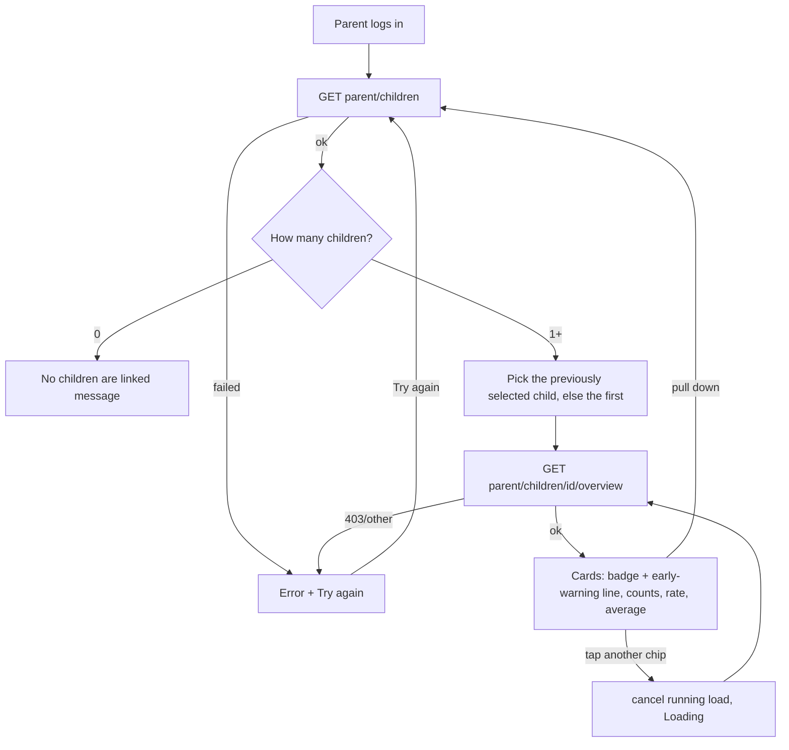
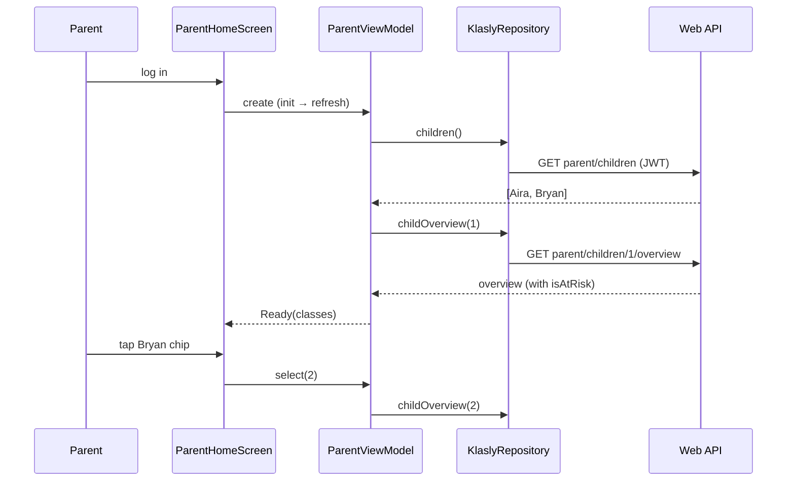

# Flowcharts — Milestone 13 Task 8 (Child overview)

## Logic

```mermaid
flowchart TD
    A[Parent logs in] --> B[GET parent/children]
    B -- failed --> E[Error + Try again]
    B -- ok --> C{How many children?}
    C -- 0 --> D[No children are linked message]
    C -- 1+ --> F[Pick the previously selected child, else the first]
    F --> G[GET parent/children/id/overview]
    G -- ok --> H[Cards: badge + early-warning line, counts, rate, average]
    G -- 403/other --> E
    H -->|tap another chip| I[cancel running load, Loading]
    I --> G
    H -->|pull down| B
    E -->|Try again| B
```

## Sequence

```mermaid
sequenceDiagram
    participant U as Parent
    participant S as ParentHomeScreen
    participant VM as ParentViewModel
    participant R as KlaslyRepository
    participant API as Web API
    U->>S: log in
    S->>VM: create (init → refresh)
    VM->>R: children()
    R->>API: GET parent/children (JWT)
    API-->>VM: [Aira, Bryan]
    VM->>R: childOverview(1)
    R->>API: GET parent/children/1/overview
    API-->>VM: overview (with isAtRisk)
    VM-->>S: Ready(classes)
    U->>S: tap Bryan chip
    S->>VM: select(2)
    VM->>R: childOverview(2)
```

No database change, so there is no ER diagram.
