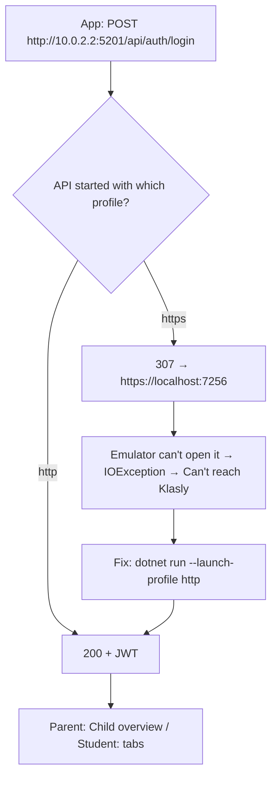
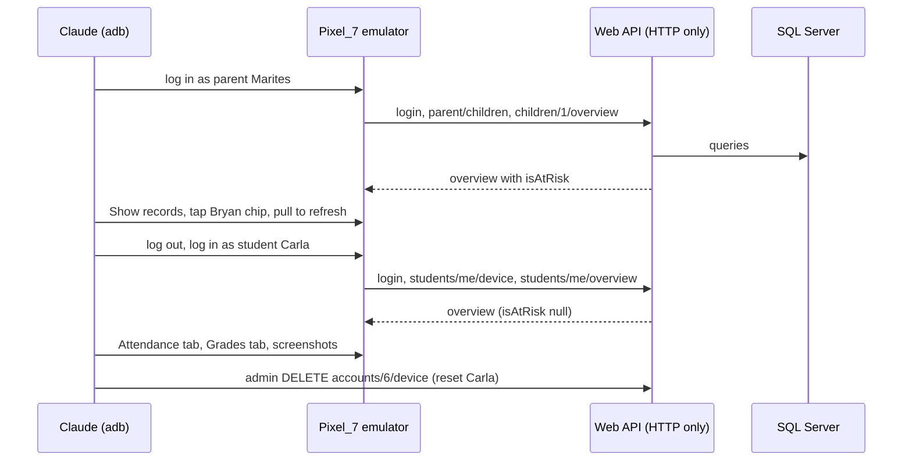

# Flowcharts — Milestone 13 device check

## Logic (why "Can't reach Klasly" happened, and the fix)

```mermaid
flowchart TD
    A[App: POST http://10.0.2.2:5201/api/auth/login] --> B{API started with which profile?}
    B -- https --> C[307 → https://localhost:7256]
    C --> D[Emulator can't open it → IOException → Can't reach Klasly]
    B -- http --> E[200 + JWT]
    E --> F[Parent: Child overview / Student: tabs]
    D --> G[Fix: dotnet run --launch-profile http]
    G --> E
```

## Sequence (what was checked)

```mermaid
sequenceDiagram
    participant C as Claude (adb)
    participant E as Pixel_7 emulator
    participant API as Web API (HTTP only)
    participant DB as SQL Server
    C->>E: log in as parent Marites
    E->>API: login, parent/children, children/1/overview
    API->>DB: queries
    API-->>E: overview with isAtRisk
    C->>E: Show records, tap Bryan chip, pull to refresh
    C->>E: log out, log in as student Carla
    E->>API: login, students/me/device, students/me/overview
    API-->>E: overview (isAtRisk null)
    C->>E: Attendance tab, Grades tab, screenshots
    C->>API: admin DELETE accounts/6/device (reset Carla)
```

No database schema change, so there is no ER diagram.
