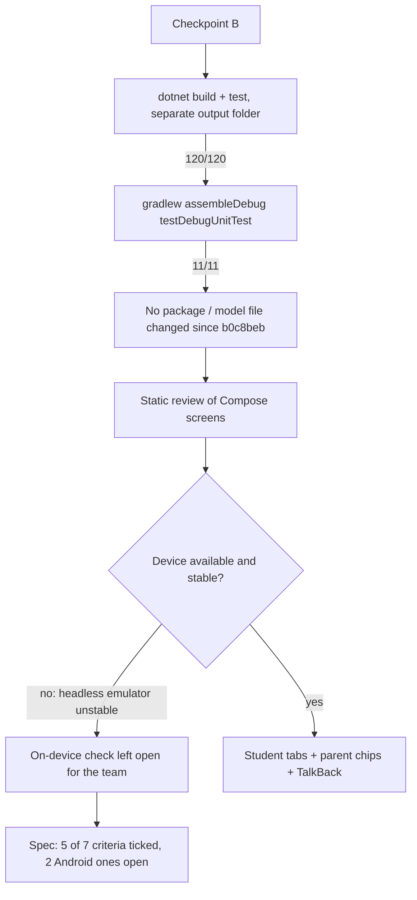
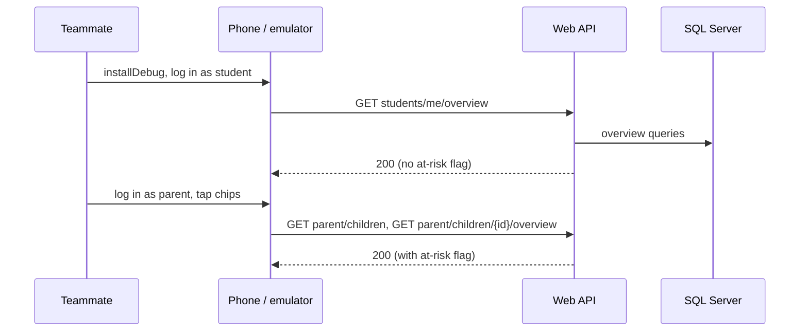

# Flowcharts — Milestone 13 Task 9 + Checkpoint B

## Logic (milestone check)

```mermaid
flowchart TD
    A[Checkpoint B] --> B[dotnet build + test, separate output folder]
    B -->|120/120| C[gradlew assembleDebug testDebugUnitTest]
    C -->|11/11| D[No package / model file changed since b0c8beb]
    D --> E[Static review of Compose screens]
    E --> F{Device available and stable?}
    F -- no: headless emulator unstable --> G[On-device check left open for the team]
    F -- yes --> H[Student tabs + parent chips + TalkBack]
    G --> I[Spec: 5 of 7 criteria ticked, 2 Android ones open]
```

## Sequence (the device check the team still needs to run)

```mermaid
sequenceDiagram
    participant T as Teammate
    participant P as Phone / emulator
    participant API as Web API
    participant DB as SQL Server
    T->>P: installDebug, log in as student
    P->>API: GET students/me/overview
    API->>DB: overview queries
    API-->>P: 200 (no at-risk flag)
    T->>P: log in as parent, tap chips
    P->>API: GET parent/children, GET parent/children/{id}/overview
    API-->>P: 200 (with at-risk flag)
```

No database change, so there is no ER diagram.
