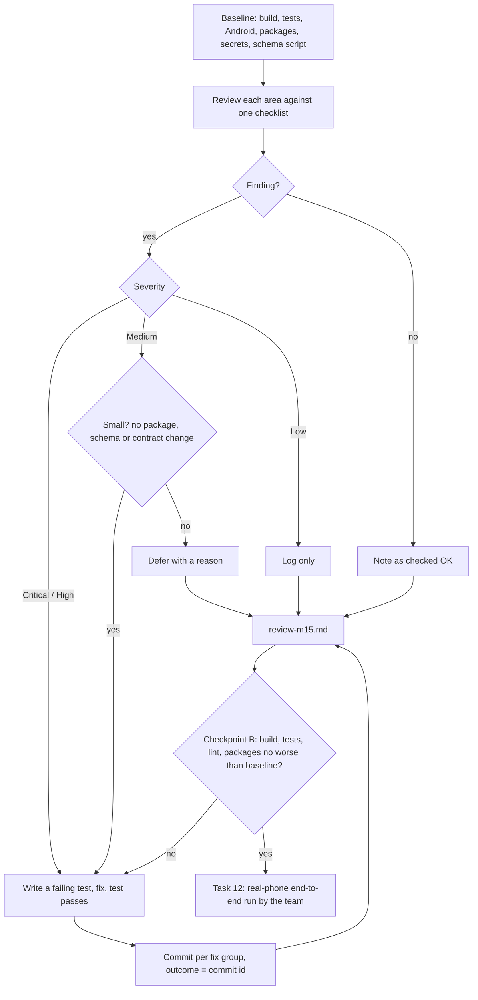
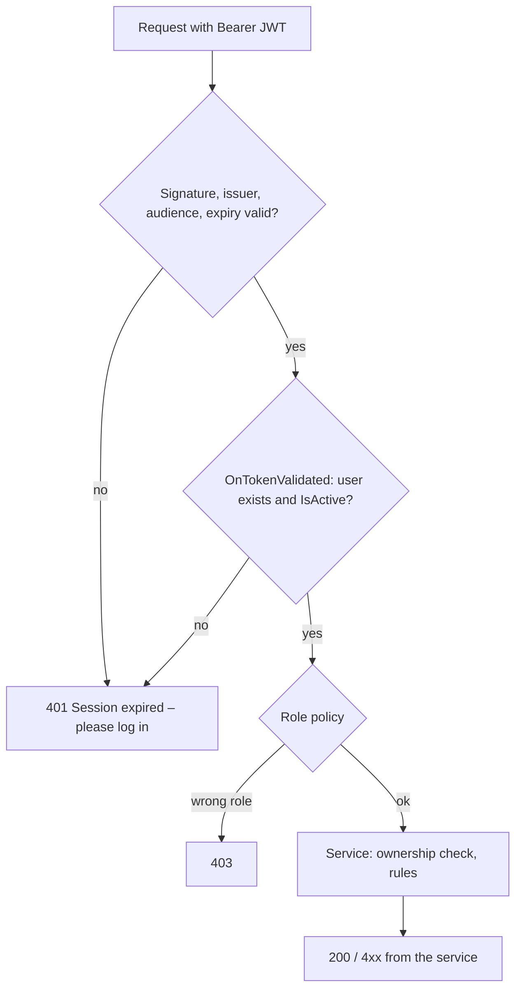
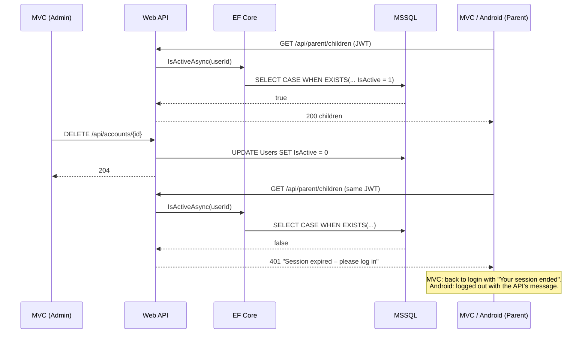

# Flowcharts — Milestone 15

## Review and fix process

```mermaid
flowchart TD
    A[Baseline: build, tests, Android, packages, secrets, schema script] --> B[Review each area against one checklist]
    B --> C{Finding?}
    C -- no --> D[Note as checked OK]
    C -- yes --> E{Severity}
    E -- Critical / High --> F[Write a failing test, fix, test passes]
    E -- Medium --> G{Small? no package, schema or contract change}
    G -- yes --> F
    G -- no --> H[Defer with a reason]
    E -- Low --> I[Log only]
    F --> J[Commit per fix group, outcome = commit id]
    H --> K[review-m15.md]
    I --> K
    J --> K
    D --> K
    K --> L{Checkpoint B: build, tests, lint, packages no worse than baseline?}
    L -- no --> F
    L -- yes --> M[Task 12: real-phone end-to-end run by the team]
```

## F-02: every API call now checks that the account is still active

```mermaid
flowchart TD
    R[Request with Bearer JWT] --> V{Signature, issuer, audience, expiry valid?}
    V -- no --> U[401 Session expired – please log in]
    V -- yes --> T{OnTokenValidated: user exists and IsActive?}
    T -- no --> U
    T -- yes --> P{Role policy}
    P -- wrong role --> F403[403]
    P -- ok --> S[Service: ownership check, rules]
    S --> OK[200 / 4xx from the service]
```

```mermaid
sequenceDiagram
    participant Admin as MVC (Admin)
    participant API as Web API
    participant EF as EF Core
    participant DB as MSSQL
    participant P as MVC / Android (Parent)

    P->>API: GET /api/parent/children (JWT)
    API->>EF: IsActiveAsync(userId)
    EF->>DB: SELECT CASE WHEN EXISTS(... IsActive = 1)
    DB-->>API: true
    API-->>P: 200 children

    Admin->>API: DELETE /api/accounts/{id}
    API->>DB: UPDATE Users SET IsActive = 0
    API-->>Admin: 204

    P->>API: GET /api/parent/children (same JWT)
    API->>EF: IsActiveAsync(userId)
    EF->>DB: SELECT CASE WHEN EXISTS(...)
    DB-->>API: false
    API-->>P: 401 "Session expired – please log in"
    Note over P: MVC: back to login with "Your session ended".<br/>Android: logged out with the API's message.
```

No database change in this milestone, so there is no `erDiagram`.
