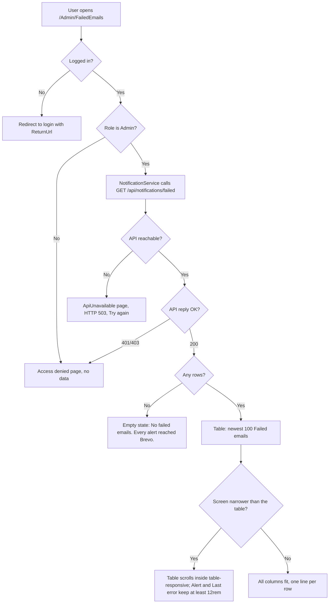
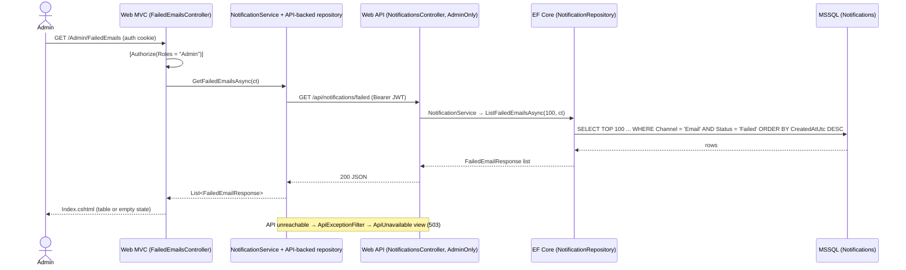

# Flowcharts: Admin › Failed emails

## Page logic

```mermaid
flowchart TD
    A[User opens /Admin/FailedEmails] --> B{Logged in?}
    B -- No --> L[Redirect to login with ReturnUrl]
    B -- Yes --> C{Role is Admin?}
    C -- No --> D[Access denied page, no data]
    C -- Yes --> E[NotificationService calls GET /api/notifications/failed]
    E --> F{API reachable?}
    F -- No --> G[ApiUnavailable page, HTTP 503, Try again]
    F -- Yes --> H{API reply OK?}
    H -- 401/403 --> D
    H -- 200 --> I{Any rows?}
    I -- No --> J["Empty state: No failed emails. Every alert reached Brevo."]
    I -- Yes --> K[Table: newest 100 Failed emails]
    K --> M{Screen narrower than the table?}
    M -- Yes --> N[Table scrolls inside table-responsive; Alert and Last error keep at least 12rem]
    M -- No --> O[All columns fit, one line per row]
```

## Across the layers

```mermaid
sequenceDiagram
    actor Admin
    participant Web as Web MVC (FailedEmailsController)
    participant Svc as NotificationService + API-backed repository
    participant API as Web API (NotificationsController, AdminOnly)
    participant EF as EF Core (NotificationRepository)
    participant DB as MSSQL (Notifications)

    Admin->>Web: GET /Admin/FailedEmails (auth cookie)
    Web->>Web: [Authorize(Roles = "Admin")]
    Web->>Svc: GetFailedEmailsAsync(ct)
    Svc->>API: GET /api/notifications/failed (Bearer JWT)
    API->>EF: NotificationService → ListFailedEmailsAsync(100, ct)
    EF->>DB: SELECT TOP 100 ... WHERE Channel = 'Email' AND Status = 'Failed' ORDER BY CreatedAtUtc DESC
    DB-->>EF: rows
    EF-->>API: FailedEmailResponse list
    API-->>Svc: 200 JSON
    Svc-->>Web: List<FailedEmailResponse>
    Web-->>Admin: Index.cshtml (table or empty state)
    Note over Svc,API: API unreachable → ApiExceptionFilter → ApiUnavailable view (503)
```

No database change, so there is no ER diagram.
