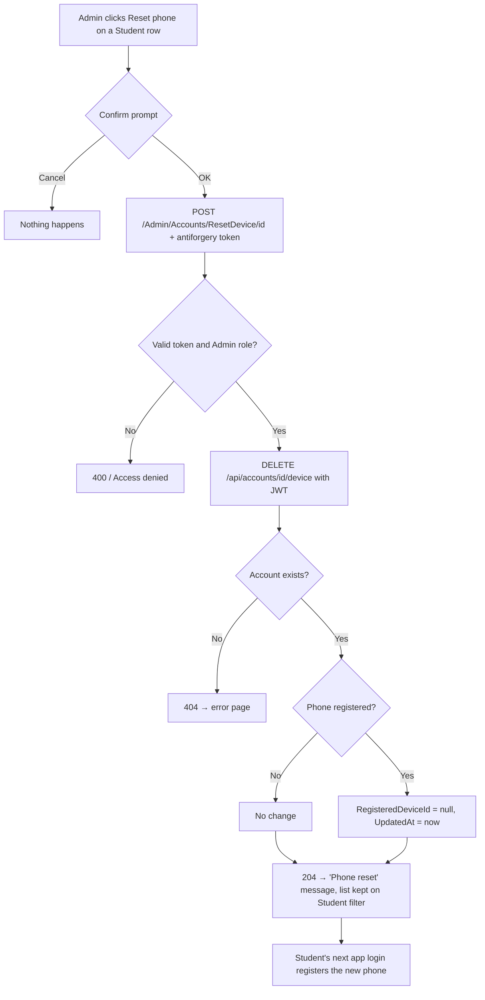
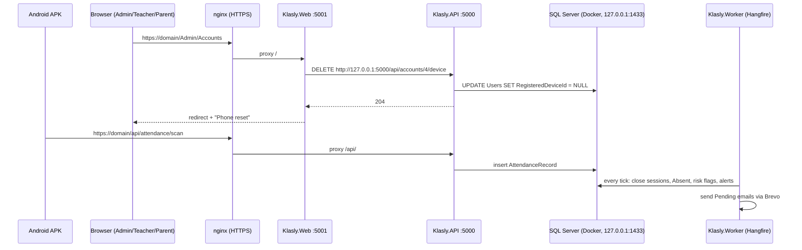

# Flowcharts: Reset phone and the VPS layout

## Reset phone (Admin › Accounts)

```mermaid
flowchart TD
    A[Admin clicks Reset phone on a Student row] --> B{Confirm prompt}
    B -- Cancel --> Z[Nothing happens]
    B -- OK --> C[POST /Admin/Accounts/ResetDevice/id + antiforgery token]
    C --> D{Valid token and Admin role?}
    D -- No --> E[400 / Access denied]
    D -- Yes --> F[DELETE /api/accounts/id/device with JWT]
    F --> G{Account exists?}
    G -- No --> H[404 → error page]
    G -- Yes --> I{Phone registered?}
    I -- No --> J[No change]
    I -- Yes --> K[RegisteredDeviceId = null, UpdatedAt = now]
    J --> L[204 → 'Phone reset' message, list kept on Student filter]
    K --> L
    L --> M[Student's next app login registers the new phone]
```

## Request path on the VPS

```mermaid
sequenceDiagram
    participant Phone as Android APK
    participant Browser as Browser (Admin/Teacher/Parent)
    participant Nginx as nginx (HTTPS)
    participant Web as Klasly.Web :5001
    participant Api as Klasly.API :5000
    participant Db as SQL Server (Docker, 127.0.0.1:1433)
    participant Worker as Klasly.Worker (Hangfire)
    Browser->>Nginx: https://domain/Admin/Accounts
    Nginx->>Web: proxy /
    Web->>Api: DELETE http://127.0.0.1:5000/api/accounts/4/device
    Api->>Db: UPDATE Users SET RegisteredDeviceId = NULL
    Api-->>Web: 204
    Web-->>Browser: redirect + "Phone reset"
    Phone->>Nginx: https://domain/api/attendance/scan
    Nginx->>Api: proxy /api/
    Api->>Db: insert AttendanceRecord
    Worker->>Db: every tick: close sessions, Absent, risk flags, alerts
    Worker->>Worker: send Pending emails via Brevo
```
