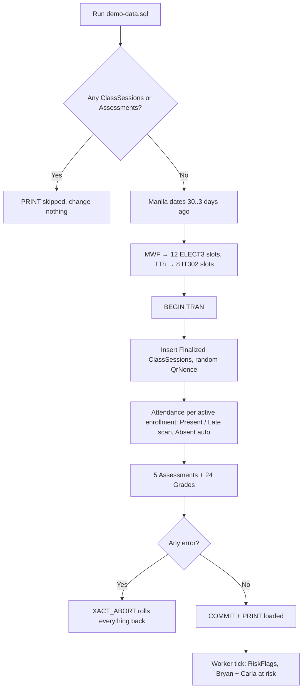
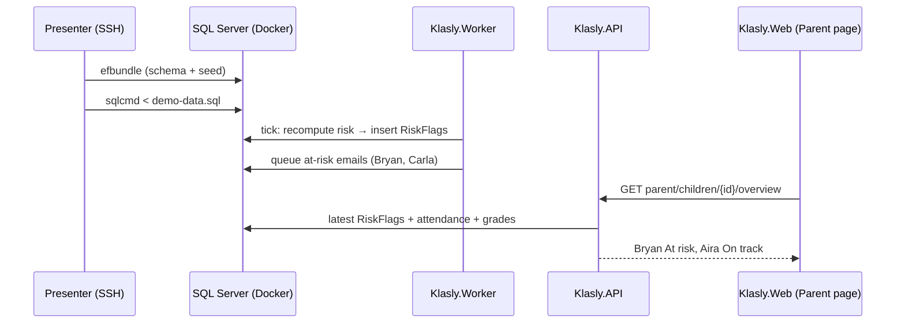
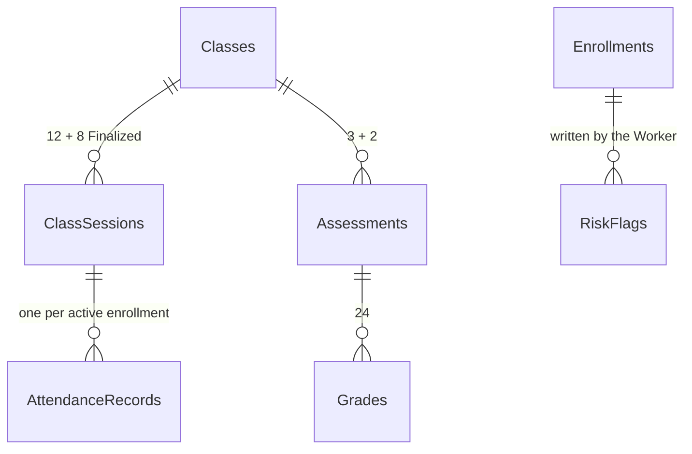

# Flowcharts: demo data

```mermaid
flowchart TD
    A[Run demo-data.sql] --> B{Any ClassSessions or Assessments?}
    B -- Yes --> C[PRINT skipped, change nothing]
    B -- No --> D[Manila dates 30..3 days ago]
    D --> E[MWF → 12 ELECT3 slots, TTh → 8 IT302 slots]
    E --> F[BEGIN TRAN]
    F --> G[Insert Finalized ClassSessions, random QrNonce]
    G --> H[Attendance per active enrollment: Present / Late scan, Absent auto]
    H --> I[5 Assessments + 24 Grades]
    I --> J{Any error?}
    J -- Yes --> K[XACT_ABORT rolls everything back]
    J -- No --> L[COMMIT + PRINT loaded]
    L --> M[Worker tick: RiskFlags, Bryan + Carla at risk]
```

```mermaid
sequenceDiagram
    participant Op as Presenter (SSH)
    participant Sql as SQL Server (Docker)
    participant Worker as Klasly.Worker
    participant Api as Klasly.API
    participant Web as Klasly.Web (Parent page)
    Op->>Sql: efbundle (schema + seed)
    Op->>Sql: sqlcmd < demo-data.sql
    Worker->>Sql: tick: recompute risk → insert RiskFlags
    Worker->>Sql: queue at-risk emails (Bryan, Carla)
    Web->>Api: GET parent/children/{id}/overview
    Api->>Sql: latest RiskFlags + attendance + grades
    Api-->>Web: Bryan At risk, Aira On track
```

```mermaid
erDiagram
    Classes ||--o{ ClassSessions : "12 + 8 Finalized"
    ClassSessions ||--o{ AttendanceRecords : "one per active enrollment"
    Classes ||--o{ Assessments : "3 + 2"
    Assessments ||--o{ Grades : "24"
    Enrollments ||--o{ RiskFlags : "written by the Worker"
```
