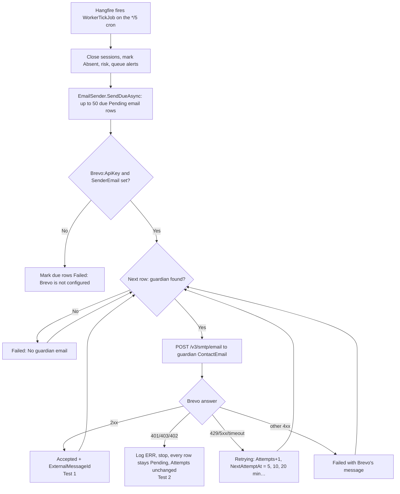
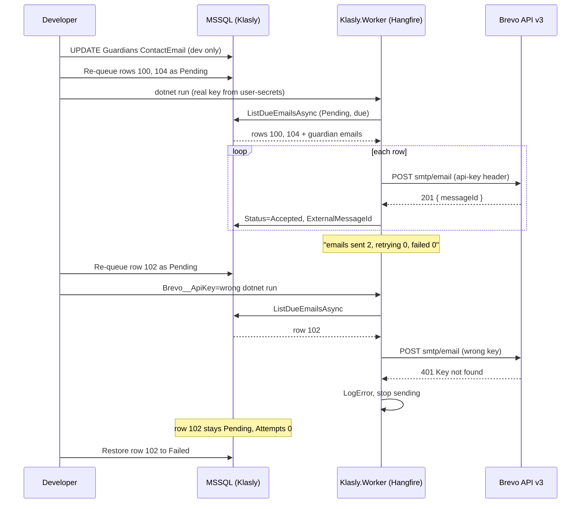

# Flowcharts — Brevo live test

## Email step of one Worker tick

```mermaid
flowchart TD
    A[Hangfire fires WorkerTickJob on the */5 cron] --> B[Close sessions, mark Absent, risk, queue alerts]
    B --> C[EmailSender.SendDueAsync: up to 50 due Pending email rows]
    C --> D{Brevo:ApiKey and SenderEmail set?}
    D -- No --> E[Mark due rows Failed: Brevo is not configured]
    D -- Yes --> F{Next row: guardian found?}
    F -- No --> G[Failed: No guardian email]
    F -- Yes --> H[POST /v3/smtp/email to guardian ContactEmail]
    H --> I{Brevo answer}
    I -- 2xx --> J[Accepted + ExternalMessageId<br/>Test 1]
    I -- 401/403/402 --> K[Log ERR, stop, every row stays Pending, Attempts unchanged<br/>Test 2]
    I -- 429/5xx/timeout --> L[Retrying: Attempts+1, NextAttemptAt = 5, 10, 20 min…]
    I -- other 4xx --> M[Failed with Brevo's message]
    J --> F
    L --> F
    M --> F
    G --> F
```

## Test 1 (good key) and Test 2 (wrong key) across the layers

```mermaid
sequenceDiagram
    participant Dev as Developer
    participant DB as MSSQL (Klasly)
    participant W as Klasly.Worker (Hangfire)
    participant B as Brevo API v3

    Dev->>DB: UPDATE Guardians ContactEmail (dev only)
    Dev->>DB: Re-queue rows 100, 104 as Pending
    Dev->>W: dotnet run (real key from user-secrets)
    W->>DB: ListDueEmailsAsync (Pending, due)
    DB-->>W: rows 100, 104 + guardian emails
    loop each row
        W->>B: POST smtp/email (api-key header)
        B-->>W: 201 { messageId }
        W->>DB: Status=Accepted, ExternalMessageId
    end
    Note over W: "emails sent 2, retrying 0, failed 0"

    Dev->>DB: Re-queue row 102 as Pending
    Dev->>W: Brevo__ApiKey=wrong dotnet run
    W->>DB: ListDueEmailsAsync
    DB-->>W: row 102
    W->>B: POST smtp/email (wrong key)
    B-->>W: 401 Key not found
    W->>W: LogError, stop sending
    Note over DB: row 102 stays Pending, Attempts 0
    Dev->>DB: Restore row 102 to Failed
```
