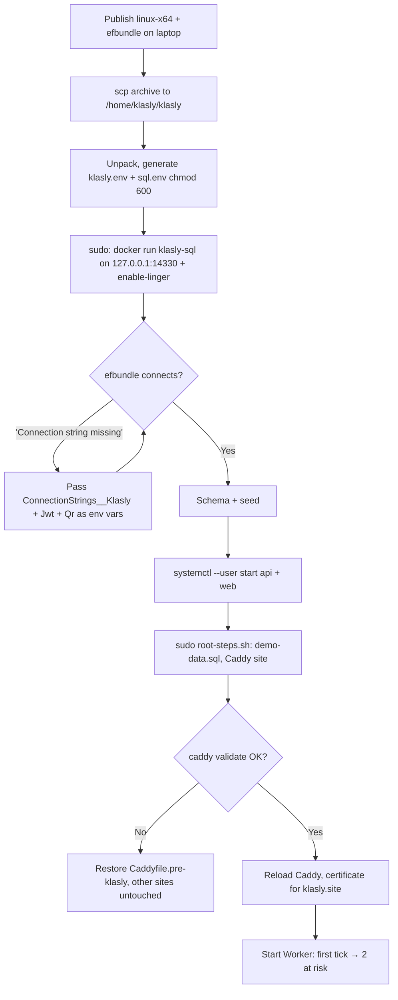
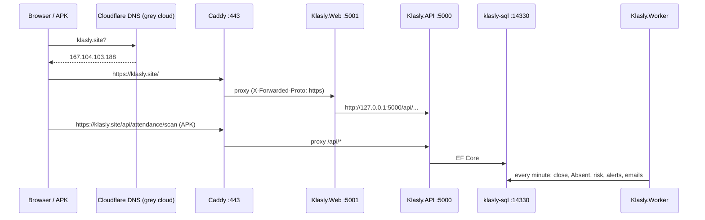

# Flowcharts: the VPS deploy

```mermaid
flowchart TD
    A[Publish linux-x64 + efbundle on laptop] --> B[scp archive to /home/klasly/klasly]
    B --> C[Unpack, generate klasly.env + sql.env chmod 600]
    C --> D[sudo: docker run klasly-sql on 127.0.0.1:14330 + enable-linger]
    D --> E{efbundle connects?}
    E -- 'Connection string missing' --> F[Pass ConnectionStrings__Klasly + Jwt + Qr as env vars]
    F --> E
    E -- Yes --> G[Schema + seed]
    G --> H[systemctl --user start api + web]
    H --> I[sudo root-steps.sh: demo-data.sql, Caddy site]
    I --> J{caddy validate OK?}
    J -- No --> K[Restore Caddyfile.pre-klasly, other sites untouched]
    J -- Yes --> L[Reload Caddy, certificate for klasly.site]
    L --> M[Start Worker: first tick → 2 at risk]
```

```mermaid
sequenceDiagram
    participant User as Browser / APK
    participant CF as Cloudflare DNS (grey cloud)
    participant Caddy as Caddy :443
    participant Web as Klasly.Web :5001
    participant Api as Klasly.API :5000
    participant Sql as klasly-sql :14330
    participant Worker as Klasly.Worker
    User->>CF: klasly.site?
    CF-->>User: 167.104.103.188
    User->>Caddy: https://klasly.site/
    Caddy->>Web: proxy (X-Forwarded-Proto: https)
    Web->>Api: http://127.0.0.1:5000/api/...
    User->>Caddy: https://klasly.site/api/attendance/scan (APK)
    Caddy->>Api: proxy /api/*
    Api->>Sql: EF Core
    Worker->>Sql: every minute: close, Absent, risk, alerts, emails
```
