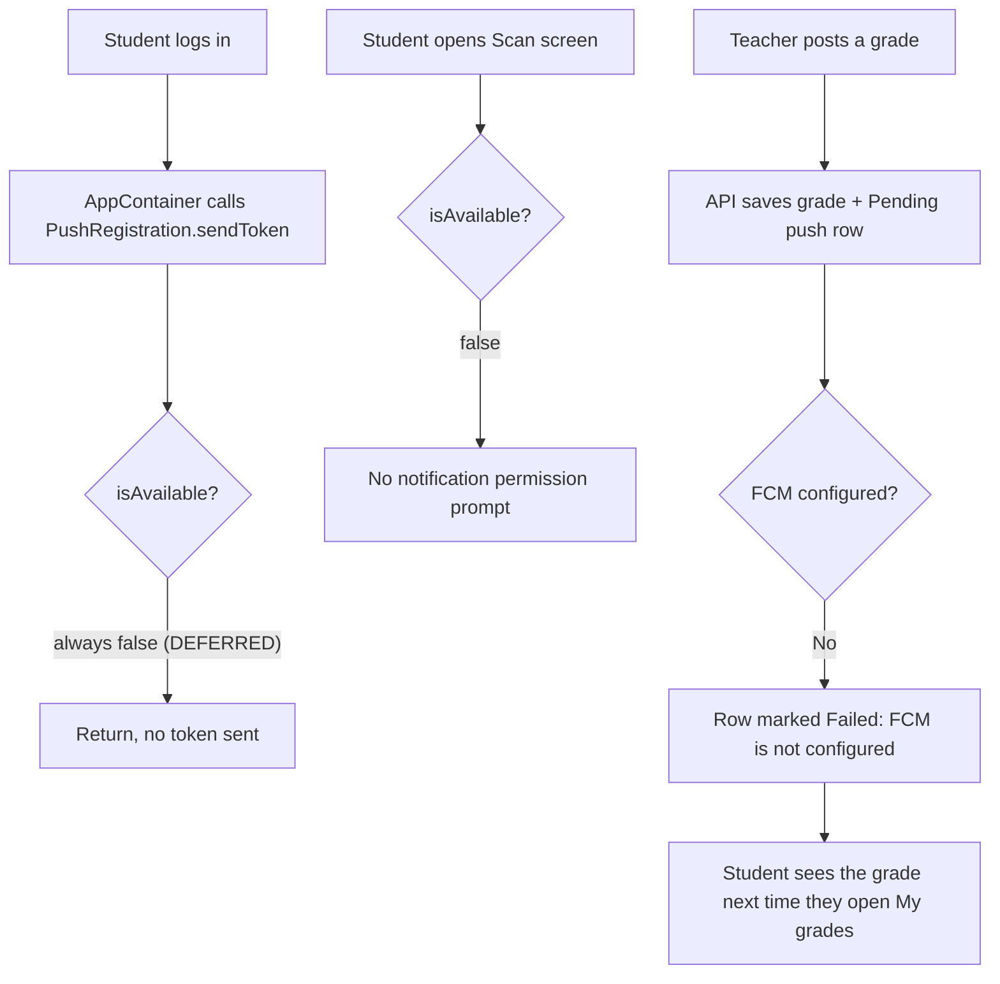
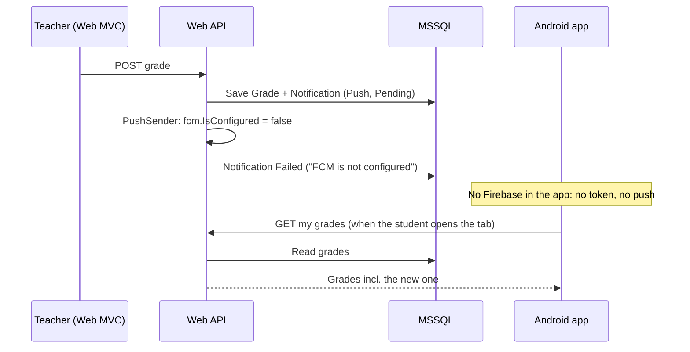

# Flowcharts — Firebase deferred in the Android app

## Logic

```mermaid
flowchart TD
    A[Student logs in] --> B[AppContainer calls PushRegistration.sendToken]
    B --> C{isAvailable?}
    C -- "always false (DEFERRED)" --> D[Return, no token sent]
    E[Student opens Scan screen] --> F{isAvailable?}
    F -- "false" --> G[No notification permission prompt]
    H[Teacher posts a grade] --> I[API saves grade + Pending push row]
    I --> J{FCM configured?}
    J -- No --> K[Row marked Failed: FCM is not configured]
    K --> L[Student sees the grade next time they open My grades]
```

## Sequence

```mermaid
sequenceDiagram
    participant T as Teacher (Web MVC)
    participant API as Web API
    participant DB as MSSQL
    participant A as Android app
    T->>API: POST grade
    API->>DB: Save Grade + Notification (Push, Pending)
    API->>API: PushSender: fcm.IsConfigured = false
    API->>DB: Notification Failed ("FCM is not configured")
    Note over A: No Firebase in the app: no token, no push
    A->>API: GET my grades (when the student opens the tab)
    API->>DB: Read grades
    API-->>A: Grades incl. the new one
```
