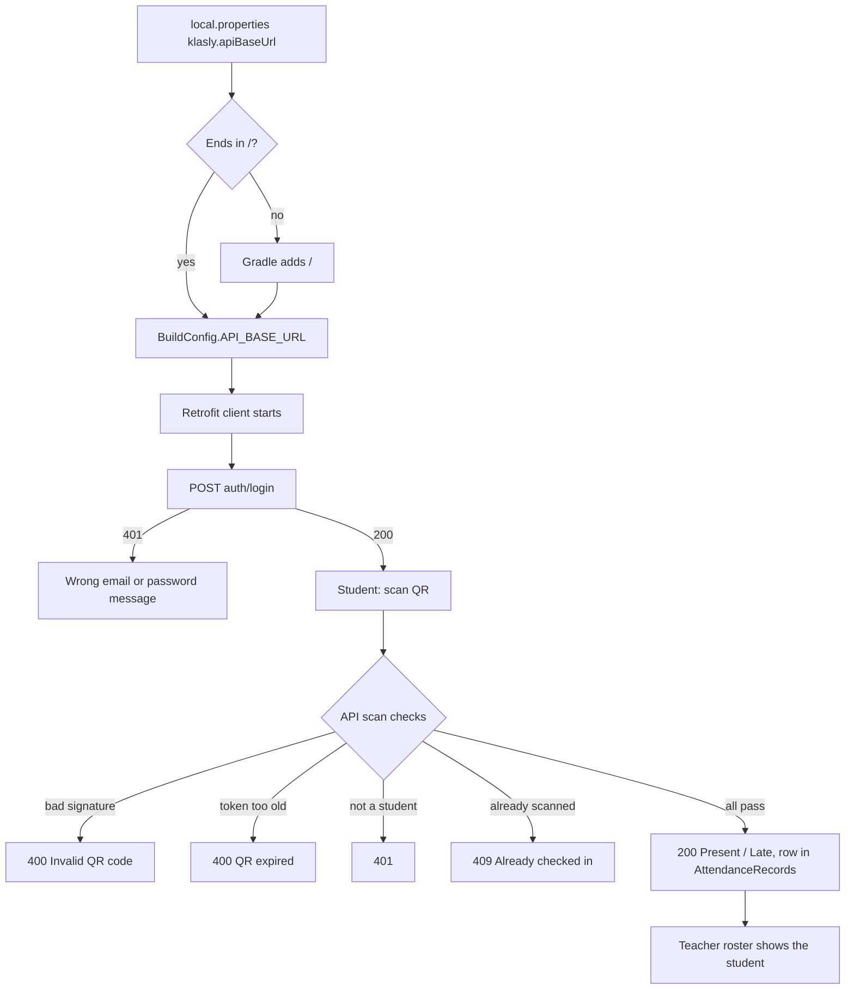
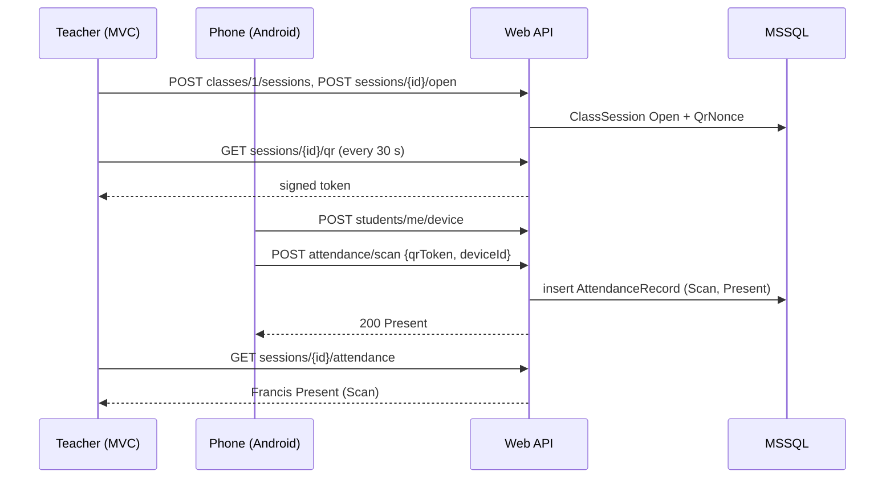

# Flowcharts: Android live API and QR check

## What the check covered

```mermaid
flowchart TD
    A[local.properties klasly.apiBaseUrl] --> B{Ends in /?}
    B -- no --> C[Gradle adds /]
    B -- yes --> D[BuildConfig.API_BASE_URL]
    C --> D
    D --> E[Retrofit client starts]
    E --> F[POST auth/login]
    F -- 401 --> G[Wrong email or password message]
    F -- 200 --> H[Student: scan QR]
    H --> I{API scan checks}
    I -- bad signature --> J[400 Invalid QR code]
    I -- token too old --> K[400 QR expired]
    I -- not a student --> L[401]
    I -- already scanned --> M[409 Already checked in]
    I -- all pass --> N[200 Present / Late, row in AttendanceRecords]
    N --> O[Teacher roster shows the student]
```

## Sequence: teacher opens, student scans, teacher sees

```mermaid
sequenceDiagram
    participant T as Teacher (MVC)
    participant P as Phone (Android)
    participant A as Web API
    participant D as MSSQL
    T->>A: POST classes/1/sessions, POST sessions/{id}/open
    A->>D: ClassSession Open + QrNonce
    T->>A: GET sessions/{id}/qr (every 30 s)
    A-->>T: signed token
    P->>A: POST students/me/device
    P->>A: POST attendance/scan {qrToken, deviceId}
    A->>D: insert AttendanceRecord (Scan, Present)
    A-->>P: 200 Present
    T->>A: GET sessions/{id}/attendance
    A-->>T: Francis Present (Scan)
```
