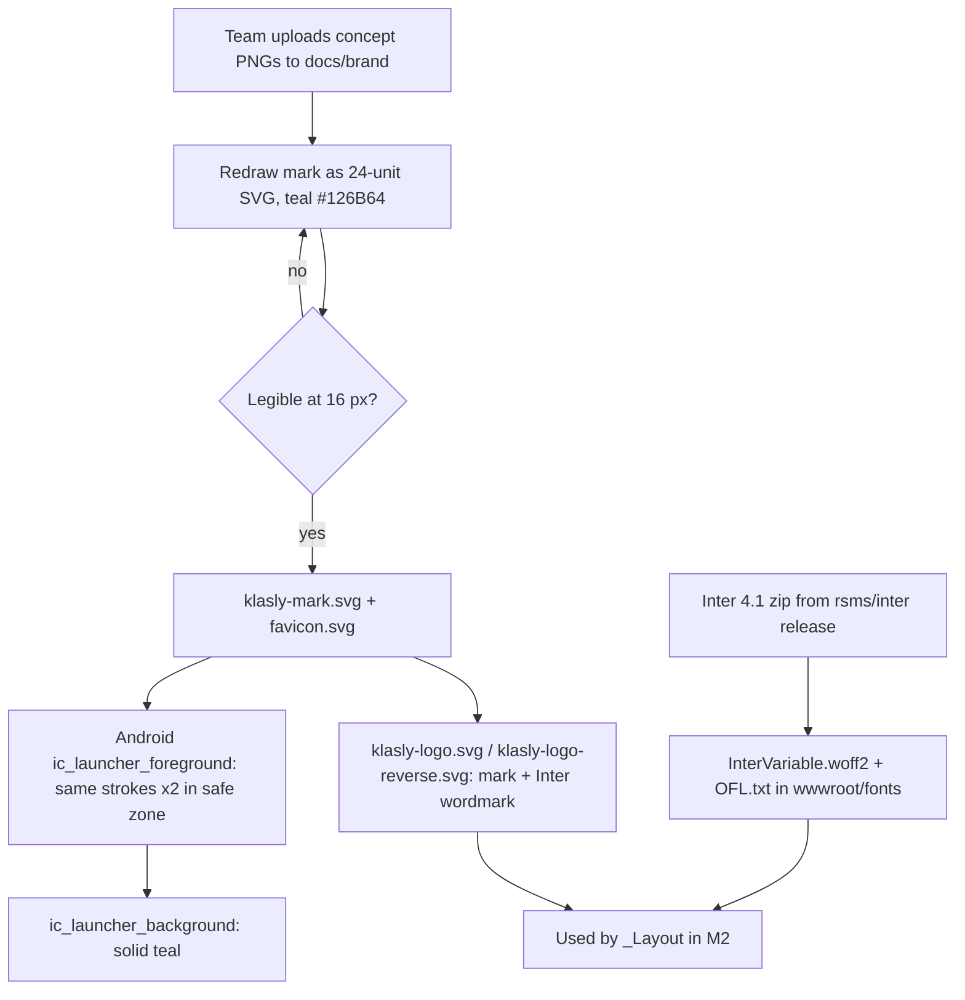
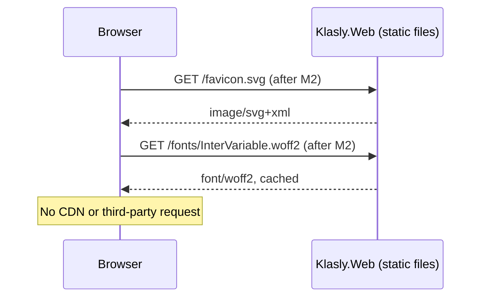

# Flowcharts — ui-brand

```mermaid
flowchart TD
  A[Team uploads concept PNGs to docs/brand] --> B[Redraw mark as 24-unit SVG, teal #126B64]
  B --> C{Legible at 16 px?}
  C -- no --> B
  C -- yes --> D[klasly-mark.svg + favicon.svg]
  D --> E[klasly-logo.svg / klasly-logo-reverse.svg: mark + Inter wordmark]
  D --> F[Android ic_launcher_foreground: same strokes x2 in safe zone]
  F --> G[ic_launcher_background: solid teal]
  H[Inter 4.1 zip from rsms/inter release] --> I[InterVariable.woff2 + OFL.txt in wwwroot/fonts]
  E --> J[Used by _Layout in M2]
  I --> J
```

```mermaid
sequenceDiagram
  participant Browser
  participant Web as Klasly.Web (static files)
  Browser->>Web: GET /favicon.svg (after M2)
  Web-->>Browser: image/svg+xml
  Browser->>Web: GET /fonts/InterVariable.woff2 (after M2)
  Web-->>Browser: font/woff2, cached
  Note over Browser: No CDN or third-party request
```
