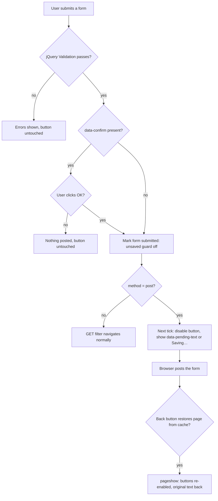
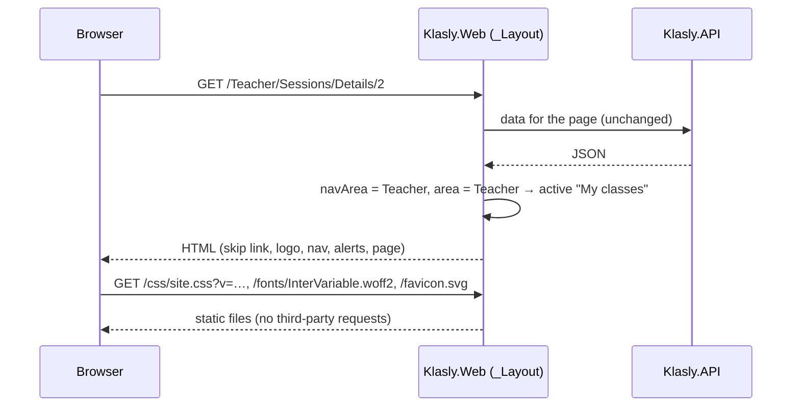

# Flowcharts — ui-foundation

## Submit guard (site.js)

```mermaid
flowchart TD
  A[User submits a form] --> B{jQuery Validation passes?}
  B -- no --> X[Errors shown, button untouched]
  B -- yes --> C{data-confirm present?}
  C -- yes --> D{User clicks OK?}
  D -- no --> X2[Nothing posted, button untouched]
  D -- yes --> E
  C -- no --> E[Mark form submitted: unsaved guard off]
  E --> F{method = post?}
  F -- no --> G[GET filter navigates normally]
  F -- yes --> H[Next tick: disable button, show data-pending-text or Saving…]
  H --> I[Browser posts the form]
  I --> J{Back button restores page from cache?}
  J -- yes --> K[pageshow: buttons re-enabled, original text back]
```

## Layout request

```mermaid
sequenceDiagram
  participant Browser
  participant MVC as Klasly.Web (_Layout)
  participant API as Klasly.API
  Browser->>MVC: GET /Teacher/Sessions/Details/2
  MVC->>API: data for the page (unchanged)
  API-->>MVC: JSON
  MVC->>MVC: navArea = Teacher, area = Teacher → active "My classes"
  MVC-->>Browser: HTML (skip link, logo, nav, alerts, page)
  Browser->>MVC: GET /css/site.css?v=…, /fonts/InterVariable.woff2, /favicon.svg
  MVC-->>Browser: static files (no third-party requests)
```
