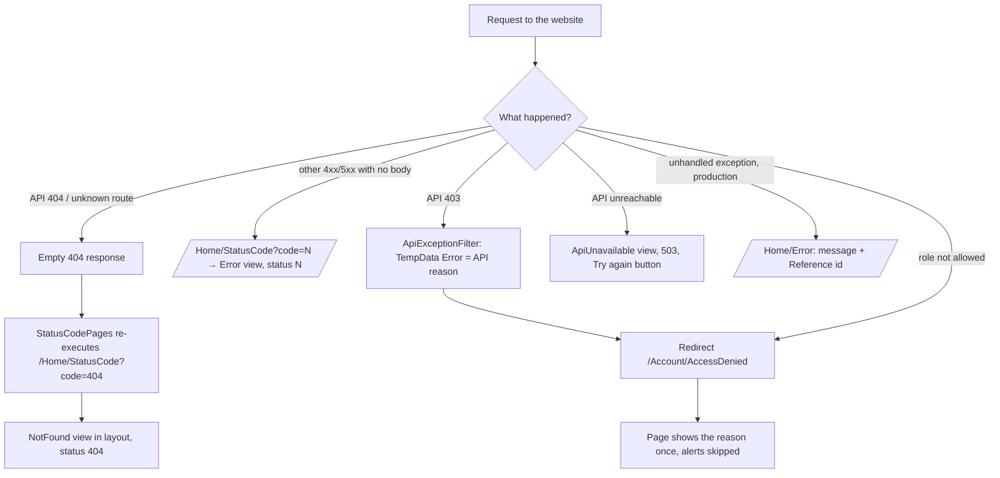
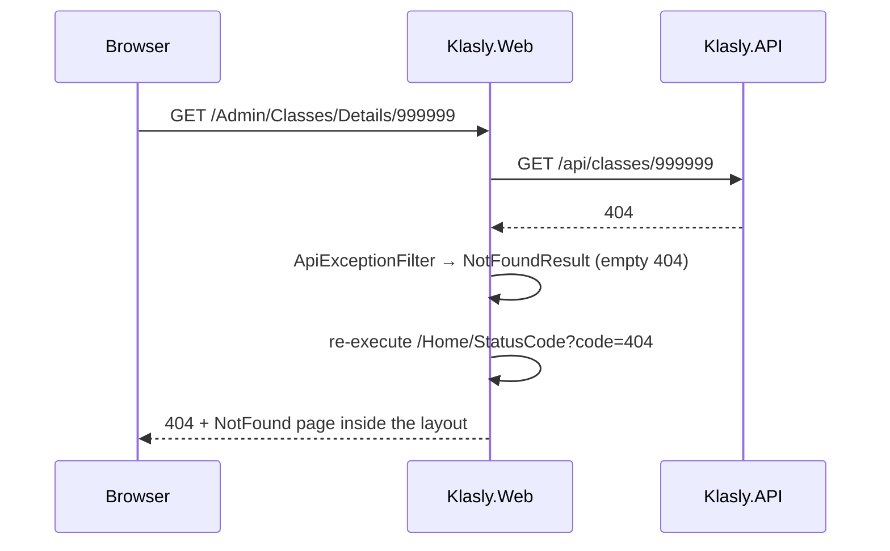

# Flowcharts — ui-message-pages

```mermaid
flowchart TD
  A[Request to the website] --> B{What happened?}
  B -- API 404 / unknown route --> C[Empty 404 response]
  C --> D[StatusCodePages re-executes /Home/StatusCode?code=404]
  D --> E[NotFound view in layout, status 404]
  B -- other 4xx/5xx with no body --> F[/Home/StatusCode?code=N → Error view, status N/]
  B -- API 403 --> G[ApiExceptionFilter: TempData Error = API reason]
  G --> H[Redirect /Account/AccessDenied]
  H --> I[Page shows the reason once, alerts skipped]
  B -- role not allowed --> H
  B -- API unreachable --> J[ApiUnavailable view, 503, Try again button]
  B -- unhandled exception, production --> K[/Home/Error: message + Reference id/]
```

```mermaid
sequenceDiagram
  participant Browser
  participant MVC as Klasly.Web
  participant API as Klasly.API
  Browser->>MVC: GET /Admin/Classes/Details/999999
  MVC->>API: GET /api/classes/999999
  API-->>MVC: 404
  MVC->>MVC: ApiExceptionFilter → NotFoundResult (empty 404)
  MVC->>MVC: re-execute /Home/StatusCode?code=404
  MVC-->>Browser: 404 + NotFound page inside the layout
```
