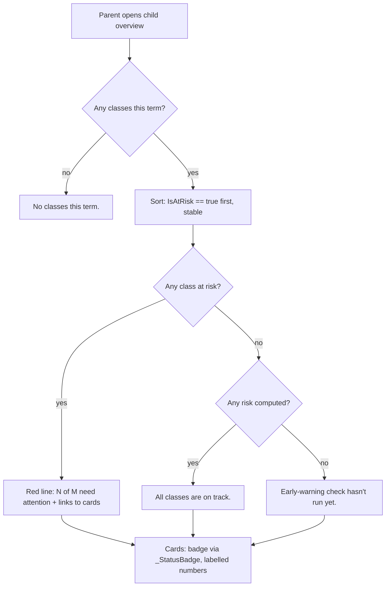
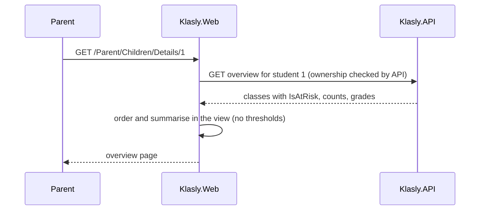

# Flowcharts — ui-parent

```mermaid
flowchart TD
  A[Parent opens child overview] --> B{Any classes this term?}
  B -- no --> C[No classes this term.]
  B -- yes --> D[Sort: IsAtRisk == true first, stable]
  D --> E{Any class at risk?}
  E -- yes --> F[Red line: N of M need attention + links to cards]
  E -- no --> G{Any risk computed?}
  G -- yes --> H[All classes are on track.]
  G -- no --> I[Early-warning check hasn't run yet.]
  F --> J[Cards: badge via _StatusBadge, labelled numbers]
  H --> J
  I --> J
```

```mermaid
sequenceDiagram
  participant Parent
  participant MVC as Klasly.Web
  participant API as Klasly.API
  Parent->>MVC: GET /Parent/Children/Details/1
  MVC->>API: GET overview for student 1 (ownership checked by API)
  API-->>MVC: classes with IsAtRisk, counts, grades
  MVC->>MVC: order and summarise in the view (no thresholds)
  MVC-->>Parent: overview page
```
