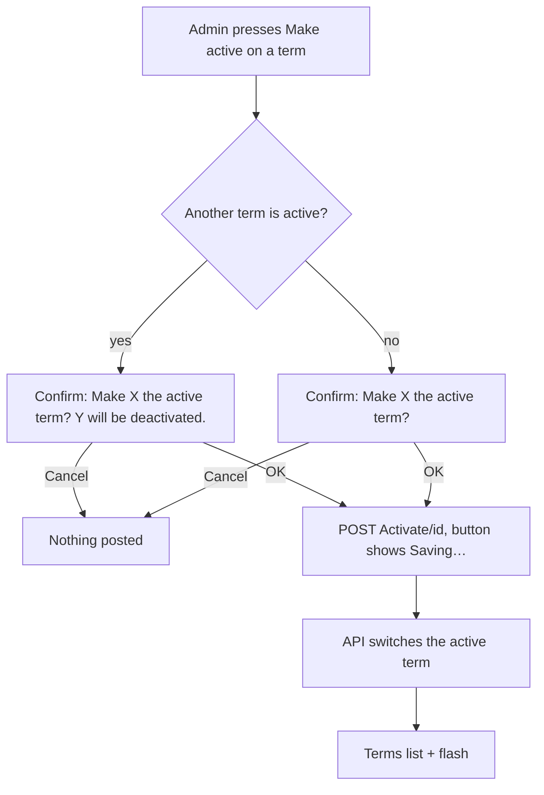
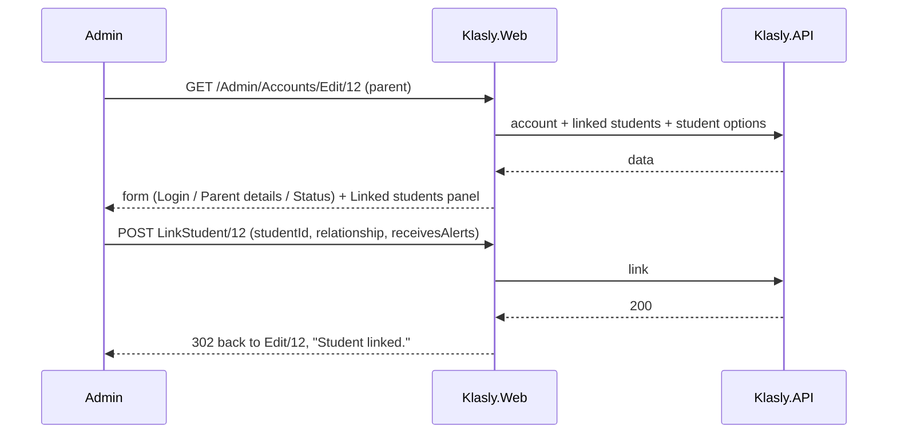

# Flowcharts — ui-admin

```mermaid
flowchart TD
  A[Admin presses Make active on a term] --> B{Another term is active?}
  B -- yes --> C[Confirm: Make X the active term? Y will be deactivated.]
  B -- no --> D[Confirm: Make X the active term?]
  C -- Cancel --> E[Nothing posted]
  D -- Cancel --> E
  C -- OK --> F[POST Activate/id, button shows Saving…]
  D -- OK --> F
  F --> G[API switches the active term]
  G --> H[Terms list + flash]
```

```mermaid
sequenceDiagram
  participant Admin
  participant MVC as Klasly.Web
  participant API as Klasly.API
  Admin->>MVC: GET /Admin/Accounts/Edit/12 (parent)
  MVC->>API: account + linked students + student options
  API-->>MVC: data
  MVC-->>Admin: form (Login / Parent details / Status) + Linked students panel
  Admin->>MVC: POST LinkStudent/12 (studentId, relationship, receivesAlerts)
  MVC->>API: link
  API-->>MVC: 200
  MVC-->>Admin: 302 back to Edit/12, "Student linked."
```
