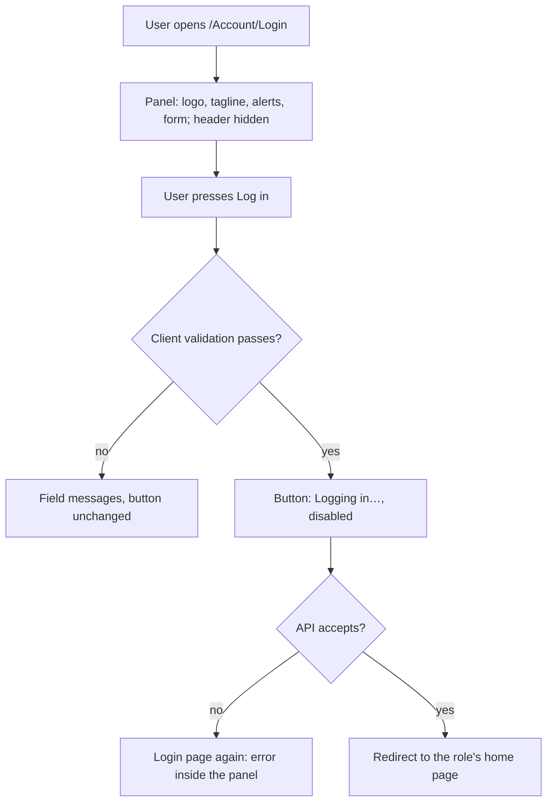
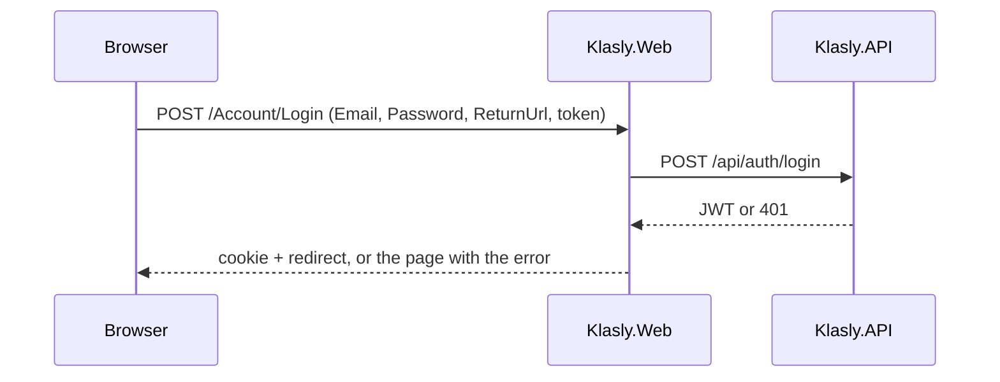

# Flowcharts — ui-auth-polish

```mermaid
flowchart TD
  A[User opens /Account/Login] --> B[Panel: logo, tagline, alerts, form; header hidden]
  B --> C[User presses Log in]
  C --> D{Client validation passes?}
  D -- no --> E[Field messages, button unchanged]
  D -- yes --> F[Button: Logging in…, disabled]
  F --> G{API accepts?}
  G -- no --> H[Login page again: error inside the panel]
  G -- yes --> I[Redirect to the role's home page]
```

```mermaid
sequenceDiagram
  participant Browser
  participant MVC as Klasly.Web
  participant API as Klasly.API
  Browser->>MVC: POST /Account/Login (Email, Password, ReturnUrl, token)
  MVC->>API: POST /api/auth/login
  API-->>MVC: JWT or 401
  MVC-->>Browser: cookie + redirect, or the page with the error
```
