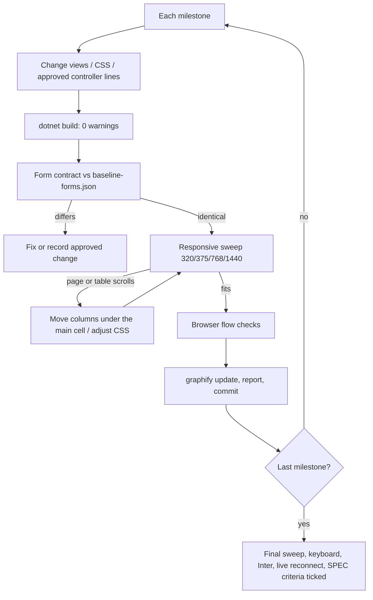
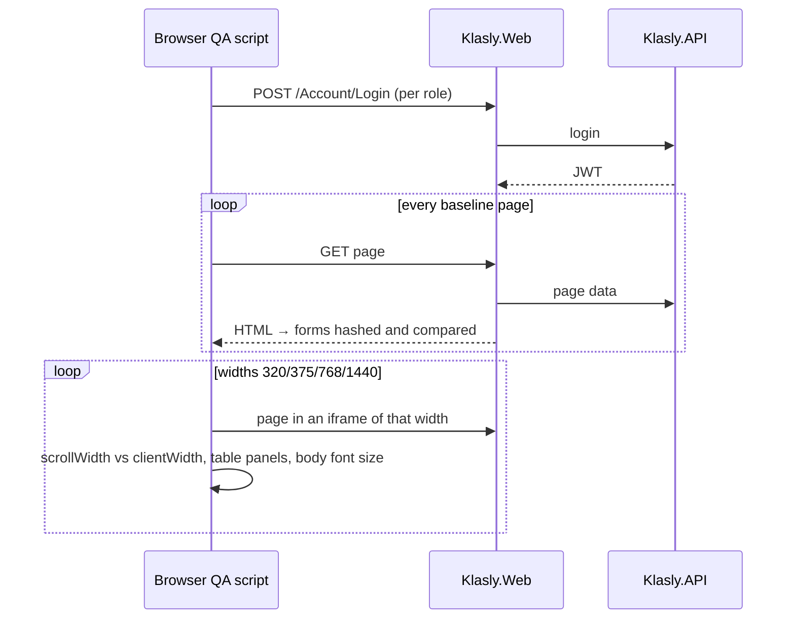

# Flowcharts — UI redesign final QA

```mermaid
flowchart TD
  A[Each milestone] --> B[Change views / CSS / approved controller lines]
  B --> C[dotnet build: 0 warnings]
  C --> D[Form contract vs baseline-forms.json]
  D -- differs --> X[Fix or record approved change]
  D -- identical --> E[Responsive sweep 320/375/768/1440]
  E -- page or table scrolls --> Y[Move columns under the main cell / adjust CSS]
  Y --> E
  E -- fits --> F[Browser flow checks]
  F --> G[graphify update, report, commit]
  G --> H{Last milestone?}
  H -- no --> A
  H -- yes --> I[Final sweep, keyboard, Inter, live reconnect, SPEC criteria ticked]
```

```mermaid
sequenceDiagram
  participant QA as Browser QA script
  participant MVC as Klasly.Web
  participant API as Klasly.API
  QA->>MVC: POST /Account/Login (per role)
  MVC->>API: login
  API-->>MVC: JWT
  loop every baseline page
    QA->>MVC: GET page
    MVC->>API: page data
    MVC-->>QA: HTML → forms hashed and compared
  end
  loop widths 320/375/768/1440
    QA->>MVC: page in an iframe of that width
    QA->>QA: scrollWidth vs clientWidth, table panels, body font size
  end
```
