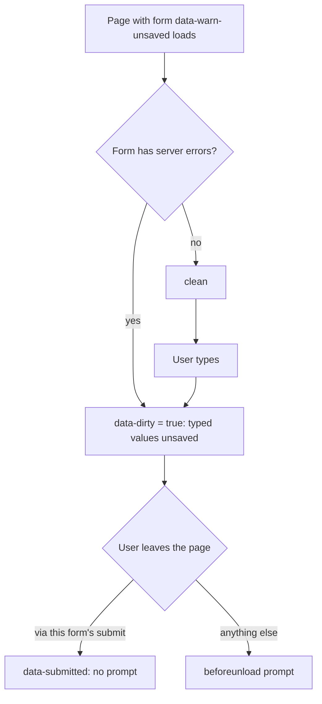
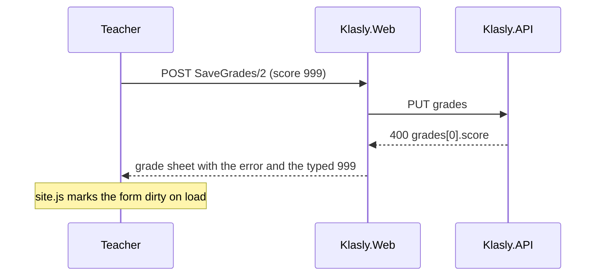

# Flowcharts — review fixes

```mermaid
flowchart TD
  A[Page with form data-warn-unsaved loads] --> B{Form has server errors?}
  B -- yes --> C[data-dirty = true: typed values unsaved]
  B -- no --> D[clean]
  D --> E[User types] --> C
  C --> F{User leaves the page}
  F -- via this form's submit --> G[data-submitted: no prompt]
  F -- anything else --> H[beforeunload prompt]
```

```mermaid
sequenceDiagram
  participant Teacher
  participant MVC as Klasly.Web
  participant API as Klasly.API
  Teacher->>MVC: POST SaveGrades/2 (score 999)
  MVC->>API: PUT grades
  API-->>MVC: 400 grades[0].score
  MVC-->>Teacher: grade sheet with the error and the typed 999
  Note over Teacher: site.js marks the form dirty on load
```
